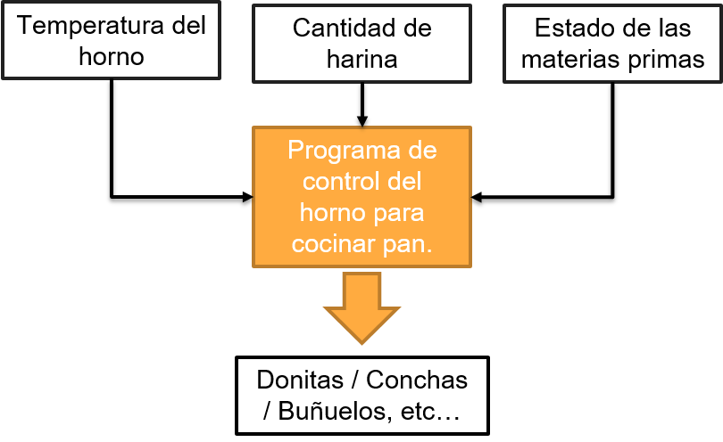
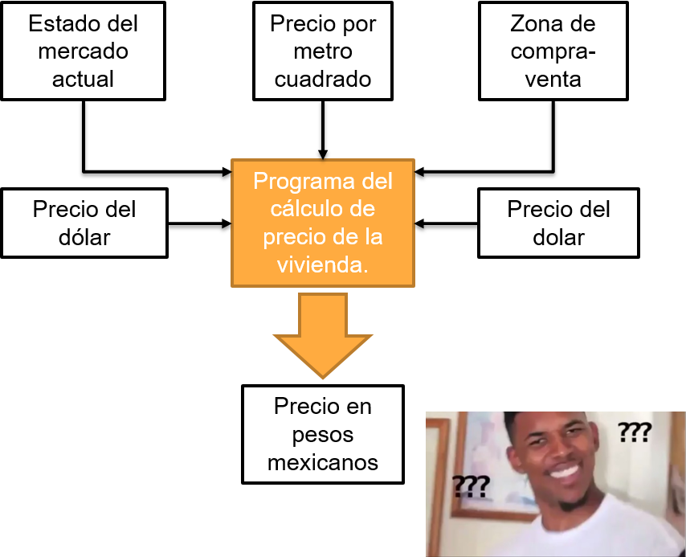
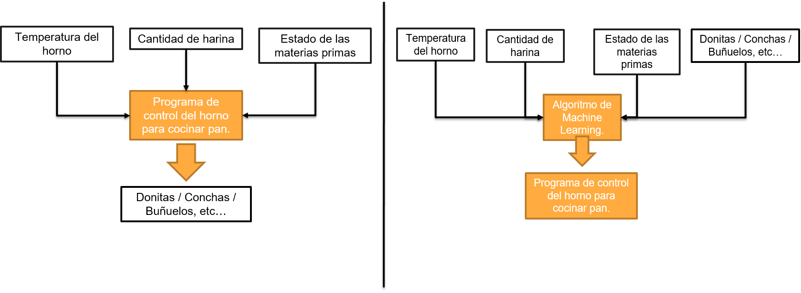
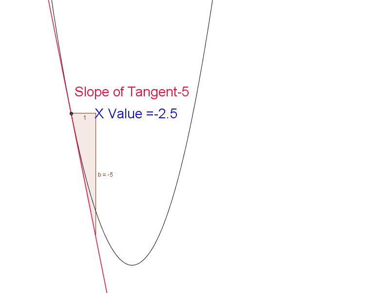
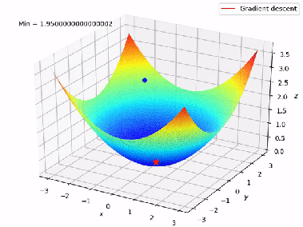
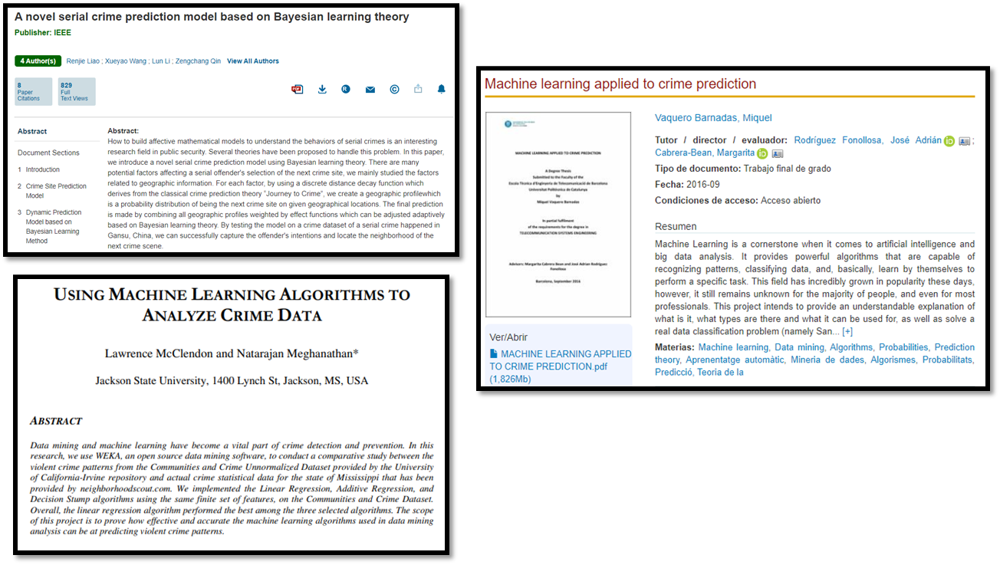
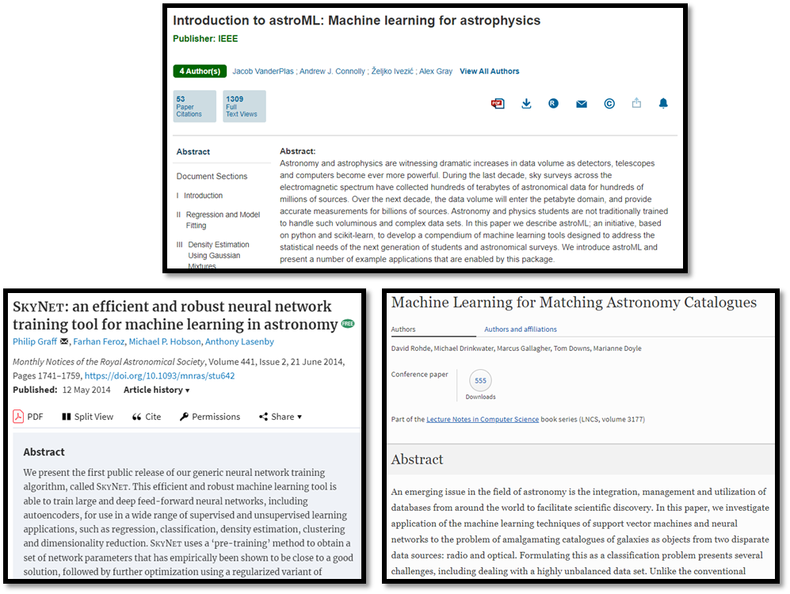
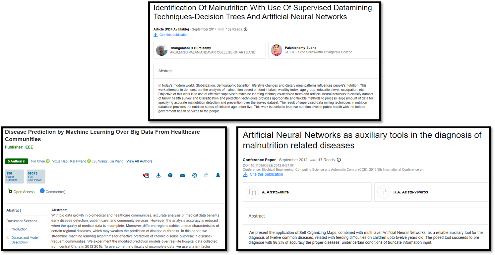

# Sesión 01: Introducción a Machine Learning

#### Objetivo: Identificar los conceptos básicos de Machine Learning (como estructura, funcionamiento, algoritmos en Python 3).    

¡Bienvenidos a su curso de Machine Learning (ML) con Python! Dado que esta es la primera sesión, quisiera comentarte cómo será el método de trabajo a partir de hoy:

1. Dedicaremos una hora y 40 minutos (1:40) a la clase para dar conceptos teóricos, colocar ejemplos y algunos retos sencillos.
2. Dedicaremos una hora para desarrollar los proyectos de la clase. Puede que tengas un proyecto en mente o todavía no, sin embargo el día de hoy nos dedicaremos a preparar un proyecto. 

Cabe destacar que Machine Learning **no es una disciplina única**: A diferencia de un curso de programación estándar donde puedes desarrollar un proyecto desde cero y en cada sesión lo mejoras, en este curso cada uno de los temas de las sesiones irá encaminado a enseñarte una herramienta diferente. 

Puede que para tu proyecto necesites una -o varias- de las herramientas que te mostramos. Sin embargo, debes de conocerlas todas y aprender en donde una herramienta funciona mejor que otra. 

¡Bienvenido nuevamente, y comencemos!

## Exactamente... ¿Qué es eso de Machine Learning? 

Hay muchas definiciones para ese elusivo concepto, desde las mas románticas como *"Darle a un pedazo de silicio la capacidad de pensar"* hasta otras mas puntuales como *"Crear programas que aprenden y se adaptan al entorno"*

En general, nosotros usaremos la definición de que un algoritmo de Machine Learning es *un sistema complejo que aprende y mejora su respuesta con los datos que recibe de entrada*

Para muestra de ello, veamos un poco acerca de la programación tradicional vs Machine Learning.

### Programación Tradicional.

Por lo general, nosotros los programadores creamos sistemas que tienen la siguiente estructura: 

Los programadores sabemos las entradas que queremos, sabemos las salidas que queremos, y generamos un programa que tome las entradas y construya las salidas. En este ejemplo, un sistema de control de un horno para cocinar y formar pan 

> *(Si, sé que el proceso de fabricar pan no es estrictamente así, pero supongamos que trabajamos en una empresa de pan a gran escala)*

Sin embargo existen algunos casos en donde:
- Las entradas parecen no tener relación con la salida.
- La lógica de mappeo entrada / salida es muy compleja.
- Hay demasiados casos posibles
- etc...

_Whoopsie! Buena suerte programando eso!_

Y bueno, ¿cómo rompemos esos límites? Necesitamos generar un algoritmo que tenga de entrada: 
- Entradas del sistema
- Salidas esperadas

Y nos dé como respuesta: **Una función matemática que haga el vínculo entre las entradas y las salidas esperadas**

*Programación Tradicional Vs Machine Learning*

### Reto 01:
>En equipos, piensen y definan un problema que hayan intentado programar y no lo hayan logrado exitosamente. 
¿Qué fue lo que falló?. 
Si hubieras tenido un sistema que aprendiera solo, ¿Habrían podido solucionarlo? ¿Cómo lo hubieran solucionado?
Discutamos sus hallazgos. 

## ¿Cómo es que una computadora puede aprender?

Para poder responder esta pregunta, primero comencemos con un reto muy simple.

### Reto 02:
> Definamos: ¿Qué es aprender? ¿Cómo puedes definir qué aprendes? 

 *(Spoilers en las siguientes líneas!)*

Aprender consiste en *Reconocer los errores y corregirlos para tratar de no cometerlos de nuevo.* Tanto en Machine Learning como en la vida diaria, si no eres capaz de reconocer un error, no eres capaz de corregirlo, por tanto no aprenderás.

El principal indicador de que estás aprendiendo (o de que tu sistema está aprendiendo) es que **conforme el tiempo pasa, la probabilidad de cometer un error disminuye drásticamente.**

Existen varias maneras de aprender, pero hablar de todas ellas sería desviar nuestra conversación hacia la rama de la psicología del aprendizaje. La que nos interesa por ahora va más encaminada hacia los procesos condicionantes de Pavlov: 

- Un refuerzo positivo: Cada vez que el sistema hace lo que yo espero, le doy una recompensa.
- Un refuerzo negativo: Cada vez que el sistema hace algo que no esperaba, le doy un castigo.

Para entender cómo funciona este condicionamiento de Pavlov en sistemas, necesitaremos ver un poco acerca de cómo funcionan las derivadas.

## Derivadas (eww...)

Sí sí, lo sé, a nadie le entusiasma trabajar con derivadas, sobre todo si las llegaste a ver en la Preparatoria, y (como yo) ya ha pasado un tiempo largo de eso, así que trataré de mantener las ecuaciones matemáticas al mínimo (creeme, a mi tampoco me apasiona el explicar matemáticas complicadas...)

Una derivada tiene un montón de definiciones, eso lo sabemos bien desde la preparatoria, pero de entre todas las definiciones, la que mas nos interesa es la que reza: *"Una derivada es una razón de cambio"*

O en un lenguaje mas coloquial: *"Una derivada nos dice que tantos cambios hay entre dos puntos. Nos dice también si la función crece o decrece en un intervalo dado."* 

Por ejemplo, observa la siguiente imagen:

Lo que nos interesa mas que nada de esa imagen es ese triangulo. Entre mas grande es ese triángulo, mas distancia hay entre dos puntos (el punto que toca la curva, y el donde acaba el triangulo). Si notas, el triángulo se vuelve un solo punto cuando se encuentra en el lugar mas bajo. Eso quiere decir que la derivada es 0.

Si si, muy bonito, y bueno, ¿eso qué tiene que ver con Machine Learning? 

Usamos derivadas como la medida de qué tantos errores comete un sistema. A mayor derivada, mas errores comete, y el objetivo de nuestros sistemas de Machine Learning es **reducir esa derivada a lo mínimo posible**

Veamos algunos ejemplos interesantes de cómo las derivadas hacen cosas con Machine Learning. 

### Ejemplo 01: Alien Isolation.

El juego de *Alien: Isolation* trata de escapar del clásico Alien de las películas. La inteligencia artificial del clásico monstruo espacial funciona con dos cerebros: Uno de los cerebros tiene el control del cuerpo del Alien, y otro cerebro tiene conocimiento de donde te encuentras en todo momento. Sin embargo, el cerebro que controla el movimiento no tiene idea de donde estás. 

¿Cómo le hace entonces el Alien para acecharte? Simple: El cerebro que sabe donde estás, le manda señales al cerebro que se mueve, en una especie de juego de *frio... frio... tibio... caliente... caliente...*

Cada vez que el cerebro del Alien recibe esas señales, lo que intenta compulsivamente es reducir la distancia entre tu y él, y ese indicador de frio-caliente es justamente *una derivada*.

Las matemáticas entonces no sirven <s>solamente</s> para torturar alumnos, sino que son una herramienta para traducir fenómenos del mundo real e insertarlos en las computadoras. Una derivada funciona entonces como esa función de frío - caliente, y los proyectos que fabricarás deberán intentar ajustarse para acercarse a un error cercano a 0. 

## Método de aprendizaje 1: Descenso en Gradiente.

La idea del descenso en gradiente es tratar de hallar el mínimo error posible. Cuando un punto ha llegado hasta abajo en una gráfica de una superficie, llega al mínimo error. Por ejemplo, observa esta gráfica: 

En este caso la esfera desciende hasta llegar al mínimo error. Esto quiere decir que el sistema ha aprendido eficazmente. Sin embargo, debes de saber que hay veces en las que ese error no siempre se reduce y se queda estancado, a eso se le llama un *"mínimo local"*. Tristemente eso no nos sirve de nada en una I.A. Ya que un mínimo local suele fallar muchisimo.

## Aplicaciones de Machine Learning en la Industria

Machine Learning ha tenido un auge enorme por una simple razón: Problemas que antes eran intratables ahora pueden atacarse con estas herramientas. Si todavía no tienes un proyecto en mente que quieras hacer, podemos ver algunas cuantas áreas que se han visto beneficiadas de Machine Learning.

### Industria Manufacturera:

Los algoritmos de Machine Learning ha sido empleados en construir semiconductores, también para optimizar tareas de trabajo en manufactura.

### Seguridad y prevención del crimen:

Los algoritmos de Machine Learning también ayudan a hallar la relación entre el crimen y el estado de la sociedad. Es un tema difícil en el que ML comienza a buscar patrones para prevenir el crimen.

### Finanzas y economía:

Machine Learning brilla cuando tiene que generar tecnología que mapee finanzas o problemas económicos. Dado que la economía es un tema complejo, ML busca patrones entre las variables económicas.

### Astrofísica y ciencias espaciales.

Dado que las ciencias espaciales están teniendo mas datos cada vez, necesitan cada vez mas de ML para darles sentido y entender los datos.

### Salud pública y prevención.

Incluso los sistemas y servicios de salud se pueden ver beneficiados por Machine Learning, una de sus aplicaciones puede ser el análisis de políticas de salud y métodos de cuidado de pacientes. 

### Arte y creatividad

Las industrias creativas están siendo profundamente transformadas por ML en este momento. ¡Estos algoritmos generativos nos están haciendo cuestionar qué significa ser creativo y cómo funciona la creatividad! Midjourney, Dall-e, Stable Diffusion, ChatGPT, etc son algunos de los ejemplos más sonados en este momento.

Otros algoritmos existen para generar voz a partir de texto, para generar música, para cambiar el timbre de la voz ¡y muchas cosas más!

## Reto 04:
> ¿Qué industria podría verse beneficada por Machine Learning? ¿Conoces algún caso en el cual se pueda ver beneficiado? **PROTIP:** Un programador debe de saber de todo. Si entiendes un área del conocimiento, puedes generar tecnología de ello. 

## Descriptores para Machine Learning.

###  Entonces ¿Qué es un descriptor?

Después de este reto, vamos a ver que es un descriptor: Una máquina es muy buena para entender cualquier cosa que tenga que ver con números. Y un descriptor sirve para asociarle números a propiedades del mundo real. 

La función de un descriptor es esa misma: *describir* un objeto por medio de números y propiedades, de tal manera que los algoritmos de ML sean capaces de tratarlos para diferenciar entre un objeto y otro. La manera en la que estos objetos son descritos es por medio de sensores.

En esta imagen podemos ver varios descriptores: Una onda de sonido representada numéricamente, un espacio de color, o un algoritmo llamado *Local Binary Pattern* (LBP)

Veamos como funcionan de manera práctica con el siguiente ejemplo: Imaginemos que tienes un separador de frutas (como manzanas). Los objetos rojos son manzanas maduras, los objetos verdes pueden ser frutas inmaduras, y los objetos de otro color podrían ser cualquier otra cosa que no es una fruta.

Y bien, ¿qué es mejor? ¿Un descriptor o un algoritmo? Sorpresivamente es mejor tener un gran descriptor que un gran algoritmo.
- Un gran descriptor puede darte un excelente resultado, aún con un algoritmo mediocre.
- Un descriptor malo te da mucha ambiguedad y malos resultados. No importando que tan inteligente sea tu algoritmo. 

###  Problemas con los descriptores.

No siempre los descriptores que elegimos son los mejores para la tarea. Tenemos que ser cuidadosos a la hora de elegirlos porque puede que no sirvan para ello. Por ejemplo: El encontrar objetos por color...

Igualmente, hay propiedades que no funcionan de la misma manera en todo el mundo. Por ejemplo, supongamos que tratas de clasificar a personas por su estatura, y si dices:

> *Asumamos que los hombres son mas altos que las mujeres*

Esto puede ser cierto en casi todos los países del mundo, excepto en Holanda, ¡Donde las mujeres suelen ser mas altas que los hombres!

Con lo que hemos visto en esta sesión, es momento de pasar al reto final de la sesión 01:

## Reto 05:
> Con lo visto hasta ahora, define un proyecto de Machine Learning que crearás al final del módulo. Puedes discutir conmigo su viabilidad y la estrategia que vamos a seguir. Recuerda: No pienses en la tecnología. Piensa en como la tecnología puede ayudar al mundo. 

