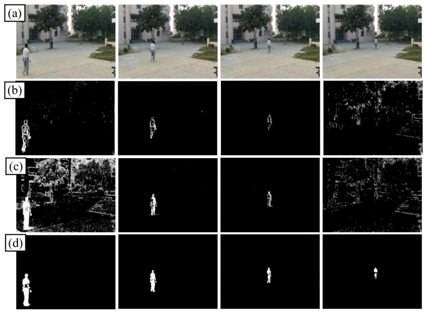

[`Machine Learning`](../../README.md) > [`Sesión 01`](../README.md) > `Reto 3`
	
## Reto 3: ¿Cómo aprende una computadora?

### 1. Objetivos :dart:

- Aterrizar la noción de *aprendizaje*

### 2. Desarrollo :rocket:

**Trabajaremos este reto en equipos**   

Mencionen al menos una aplicación en donde la distancia (o la resta) pueda ayudar a resolver un problema. **Tip**: Hay muchisimas aplicaciones en montones de áreas! Solo tienes que utilizar tu imaginación. 

Un ejemplo bastante cool es el de distancia en imágenes. Los píxeles de una imagen pueden restarse entre un cuadro y otro:

- Si dos imágenes no tienen cambios, la resta es 0 porque los cuadros son la misma imagen.
- Pero si los dos cuadros (frames) cambian, quiere decir que algo se movió. En los puntos donde hay movimiento hay pixeles encendidos en color. 

Con una simple resta puedes generar un sistema de detección de movimiento. Mejor aún: Si aplicas la distancia euclidiana entre dos cuadros, puedes definir que tanto movimiento hubo. Los sistemas de seguridad por videovigilancia confían mucho en este principio. 

 

[`Anterior`](../Reto01/README.md) | [`Siguiente`](../README.md)

