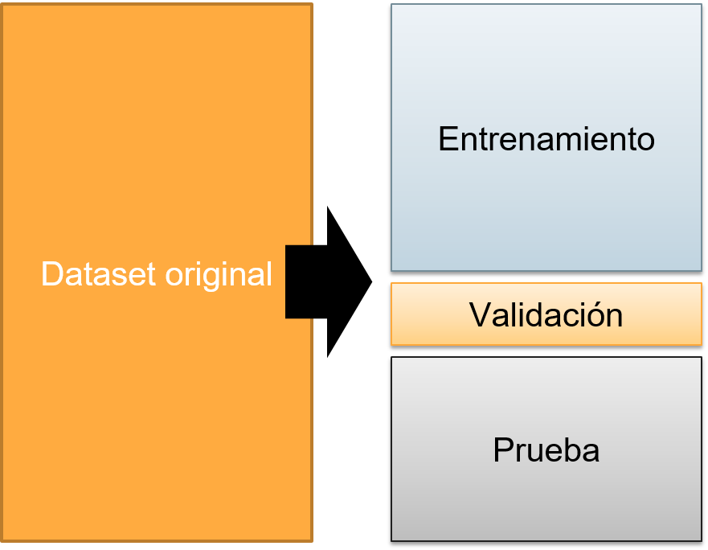
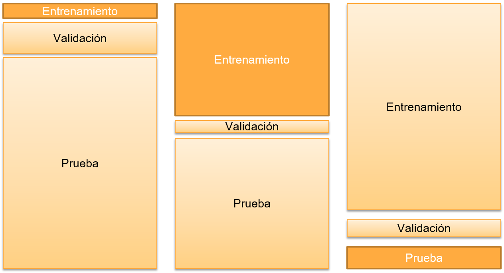
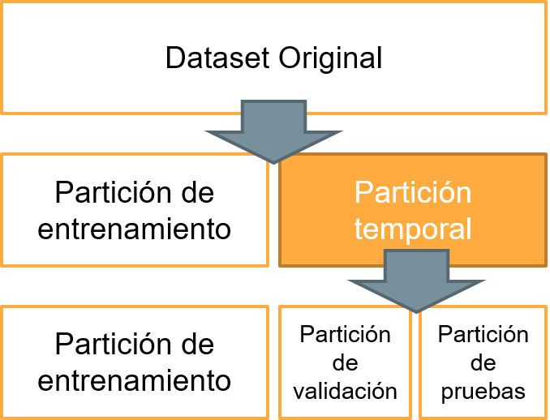
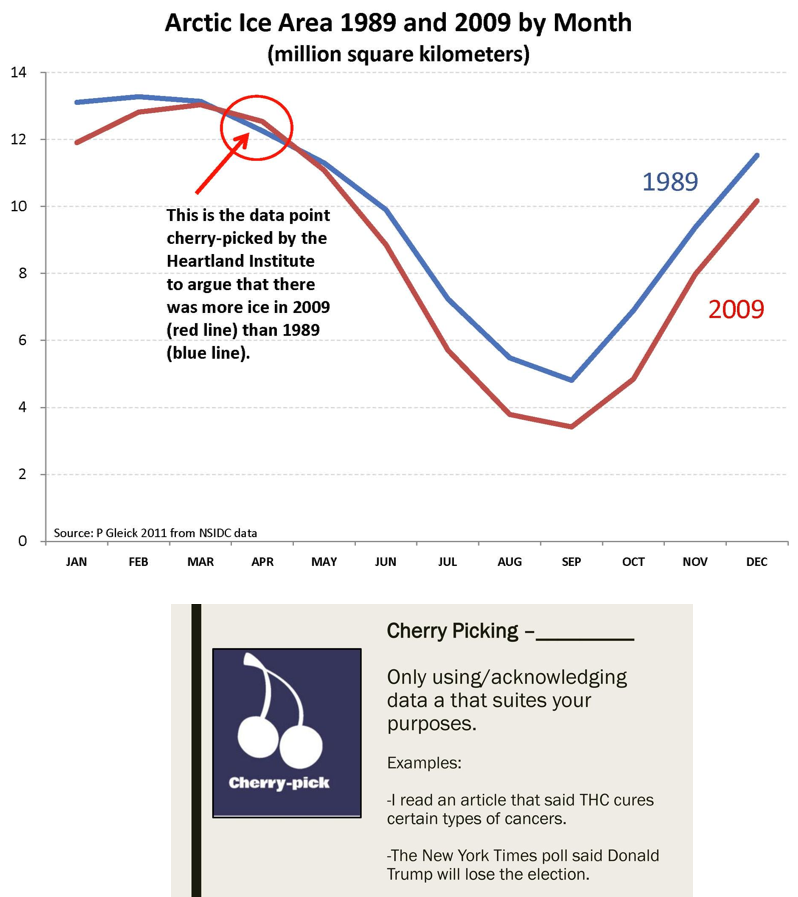
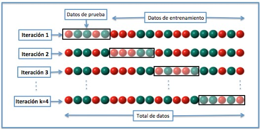
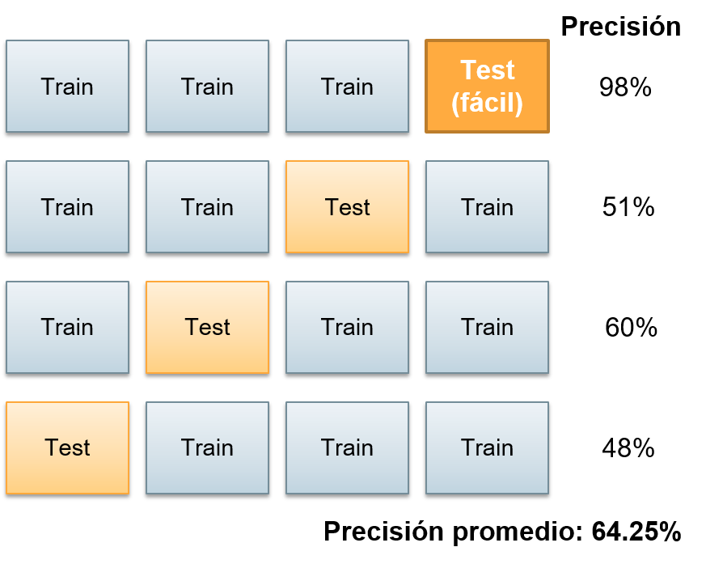
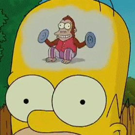
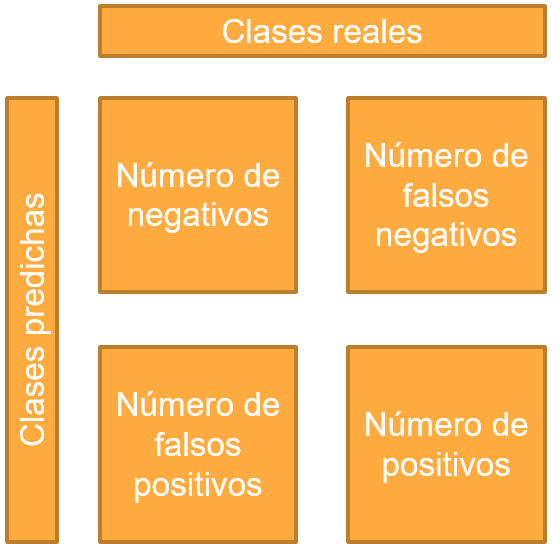
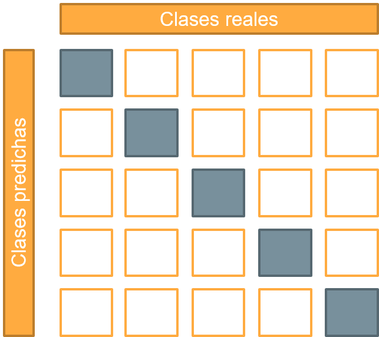

# Sesión 02: Separación, validación y evaluación para algoritmos de ML  

#### Objetivo: Construir algoritmos de separación de conjuntos de datos en entrenamiento / validación / prueba y algoritmos de evaluación de clasificadores de ML (clasificación binaria y multiclase).       

¡Bienvenido a la segunda sesión de Machine Learning! En esta sesión nos enfocaremos enteramente en crear herramientas que nos serán útiles no solamente en lo que resta del curso, sino en cualquier momento que deseemos implementar Machine Learning.

El primer tema que trataremos es el de separación de datos. A partir de este módulo comenzaremos a utilizar Python 3 constantemente, por lo que te recomiendo tener a la mano tu cuaderno de Jupyter. Te recomiendo que veas los ejemplos, pero que también hagas tus propias implementaciones. Recuerda, la programación es un asunto más de práctica que de memorización.

## Separación de datos.

Los algoritmos de Machine Learning van a aprender invariablemente de los datos que les proporcionemos. Los algoritmos constantemente van a estar ajustándose para adaptarse a los datos mostrados, sin embargo esto no tiene ninguna ciencia. Lo importante es que un algoritmo *pueda predecir y procesar datos que nunca antes ha visto*.

En esta gráfica puedes notar que los puntos en verde obscuro son datos de prueba. Esto quiere decir que el algoritmo de ML es capaz de procesar aún con datos que jamás ha tratado. Esa es la verdadera inteligencia que se espera de ML.

> _Supongamos que te memorizas un libro entero de matemáticas, sin embargo no entendiste nada, sólo lo memorizaste. ¿De qué sirve si el profesor cambia el problema con otros datos? Lo mismo pasa con los algoritmos de ML: La inteligencia artificial asume que se topará con datos jamás vistos antes._

¿Qué sucede si tu algoritmo de Machine Learning solamente ha aprendido que debe reconocer autos de color rojo como automóviles? Cuando vea un automóvil de color negro o azul, ¿será capaz de reconocerlo como un automóvil? Lo más probable es que no. 

Por ende, si tu algoritmo de ML siempre ha aprendido con datos de un tipo, es difícil que sea capaz de generalizar con datos de otro conjunto. Para evitar este problema, tu algoritmo debe de trabajar con una separación de datos. 

Un ejemplo de la vida real: Los automóviles con piloto automático han sido extensamente entrenados para reconocer personas, pero casi todas son personas con tez clara. Las personas con tez obscura corren el riesgo potencial de que el sistema no las reconozca. Esto -evidentemente- es un problema muy grave. 

> _ Si ordenas tu habitación y encuentras algo que nunca has visto antes, es probable que le tengas mucho miedo y que no quieras ni tocarlo. ¡Lo mismo pasa cuando un algoritmo no es capaz de clasificar algo!_

Lo mas común es que un científico de datos separe un conjunto de datos (también llamado *Dataset*) en tres fragmentos de forma aleatoria: 
- **Partición de entrenamiento:** Una partición de entrenamiento servirá para que tu algoritmo se ajuste, entrene y aprenda lo más que pueda. 

- **Partición de validación:** En cada ciclo (o en cada N ciclos, como tú decidas), la partición de validación servirá para evaluar tu algoritmo y decidir qué tal va aprendiendo. Esta partición de evaluación es sumamente útil cuando tu algoritmo está tomando muchísimo tiempo en aprender. 

- **Partición de prueba:** Una vez que el algoritmo ha terminado de entrenar, con la partición de pruebas veremos qué tan listo realmente es tu algoritmo. 

### Malas particiones: ¿Qué pasa si tenemos una partición de entrenamiento reducida?

Cuando hay pocos datos de entrenamiento, tu algoritmo de Machine Learning corre el riesgo de fallar mucho en validaciones y pruebas. Si el algoritmo de aprendizaje se repite muchas veces, es posible que caigas en algo llamado *"Overfitting"* que es cuando un algoritmo se aprende excepcionalmente bien un conjunto muy pequeño de datos, sin embargo es incapaz de reconocer datos nuevos. 

En general, va a tener un desempeño muy muy bajo.

### Malas particiones: ¿Qué pasa si tenemos una partición de validación reducida?

Cuando hay una validación muy pequeña puede que no ocurra nada malo. Pero te darás cuenta de que tu algoritmo tuvo éxito o falló hasta que termine de entrenar y lo pruebes. Si no te das cuenta de que el entrenamiento va fallando, y esperaste varios días para obtener el resultado, quizás hayas perdido tu tiempo.

Sin embargo, este no es el peor escenario. Si un algoritmo se entrena lo bastante rápido, no pasa nada si tienes una validación reducida (o de plano suprimes la validación). En el caso de que tu algoritmo tarde horas, días o incluso semanas en entrenar... Lo mejor será tener una buena cantidad de datos en validación, para evitar tener que esperar hasta que una catástrofe de tiempo perdido ocurra.

### Malas particiones: ¿Qué pasa si tenemos una partición de pruebas reducida?

Este es el peor escenario posible. Una partición muy pequeña hará que no te des cuenta de si tu algoritmo es realmente inteligente o no. Pocos datos de referencia no sirven para tener una conclusión lo bastante eficaz, por lo que no sabrás qué tan listo es tu algoritmo y, en el peor escenario, podrías sobreestimarlo (creer que es mejor de lo que realmente es). 

>Si implementas un algoritmo así, es **MUY** probable que falle a la larga. Esto es catastrófico para cualquier negocio o inclusive peligroso para aplicaciones que requieren precisión casi absoluta (como sistemas médicos). Advertido estás.

### ¿Cuál es una buena partición entonces?

Si tienes muchos datos (más de 400,000 datos podríamos considerarlos como muchos) una buena proporción puede ser: 
- 60 % de los datos para entrenamiento.
- 10 % de los datos para validación.
- 30 % de los datos para pruebas.

¿Tienes pocos datos? (digamos, unos 500), puedes utilizar: 
- 80% de los datos para entrenamiento.
- 5% de validación.
- 15% para pruebas.

Si tu algoritmo entrena lo bastante rápido, puedes quitar la partición de validación y añadir esos datos a la partición de pruebas.

### Creando particiones con Scikit Learn.

El método de creación de particiones es: 
1. Primero crea una partición de entrenamiento: Scikit Learn separará aleatoriamente en dos partes el entrenamiento, con la proporción que le indiques.
2. Luego, con la partición sobrante, separa en 2: una para validación y otra para pruebas.

Para ver el código de cómo hacer una partición, sigue este link: [Ejemplo 01](Sesion-02/Ejemplo-01)

## Reto 01:
> ¡Con este código [Reto 01](Sesion-02/Reto-01) utiliza y juega con la función de particionar! Prueba con diferentes combinaciones. Si tienes un dataset para tu proyecto, úsalo para separar los datos en tres grupos. **PROTIP:** Mantén está función entre tus códigos, porque será útil no sólo para este módulo, sino en general cuando hagas Machine Learning.

## Validación cruzada.

Existe una falacia llamada ***Cherry Picking*** (o argumentos selectivos) que es algo muy común que suele hacerse con estudios científicos con poca ética: algunos eligen datos mas fáciles de clasificar para ensamblar el dataset de pruebas. 

Cuando usas esta clase de datos tienes una alta precisión y pareciera que tienes razón en un punto que deseas probar; sin embargo, cuando el sistema que quieres probar lo implementas en la realidad, falla estrepitósamente. 

Cherry Picking es una falacia que muchas personas utilizan en muchos temas: El hecho de solamente tomar los datos que te convienen para sustentar un punto de vista hace que tus argumentos se vuelvan relativamente “sólidos”, pero dan una visión incompleta del mundo. El primer paso para evitar esto es darte cuenta de que existe y que a veces lo cometemos sin querer.

>Muchos movimientos pseudocientíficos utilizan esta falacia de pensamiento para hacer pasar sus creencias como válidas. Como científico de datos no debes dejar pasar esto ni permitirlo. Movimientos como los antivacunas, tierraplanistas, detractores del cambio climático, etc. utilizan esto para convencer a otros.

¿Cómo evitar este problema? Para evitar que eso nos pase (por error o por negligencia) la mejor manera de hacerlo es utilizar un mecanismo llamado *Validación Cruzada*. 

En la validación cruzada, todos los datos son utilizados para entrenar, y todos los datos son utilizados para probar (no al mismo tiempo, evidentemente). Y con ello nos aseguramos que no existan datos "favoritos". 

Vamos a poner un ejemplo en donde se notará cómo se rompe la falacia de *Cherry Picking* con la herramienta de validación cruzada: Supongamos que tienes unos datos de prueba "fáciles" que te dan una gran precisión de 98%. 

Sin embargo, en una segunda ronda de entrenamientos, ya no tendrás esos datos fáciles, y tu precisión caerá constantemente con cada iteración. Con ello no podrás engañarte (o engañar a otros) al elegir datos fácilmente clasificables.

Eso sí: si tu algoritmo tiene una gran precisión en cada iteración, quiere decir que tu sistema es realmente bueno.

Este sistema de validación cruzada se llama **K-Fold** porque divides tu dataset en **K** partes.

Por ejemplo: 3-Fold significa que dividiste tu dataset en 3 partes (A, B, y C)
- En la ronda 1, usas A y B para entrenar, y C para probar.
- En la ronda 2, usas A y C para entrenar, y B para probar.
- En la ronda 3, usas B y C para entrenar, y A para probar.

Promedias los resultados de todas las rondas, y sabes qué tan bueno es tu algoritmo realmente. 

Para verlo en acción, puedes echar un vistazo al [Ejemplo 02](Sesion-02/Ejemplo-02)

## Reto 02:
> ¡Intenta utilizar K-Fold en tu dataset en este [cuaderno!](Sesion-02/Reto-02) Nota que K-Fold va a requerir que hagas K entrenamientos más adelante. Verifica que los datos estén separados como lo esperas, e intenta con números pequeños (2-fold, o 3-fold)

## Leave-One-Out Cross Validation

Leave-One-Out Cross Validation es llevar el K-fold al extremo: Utilizas todo tu dataset para entrenar, y solamente un dato para probar, sin embargo este dato va oscilando por todo el dataset, esto quiere decir que evalúas dato por dato hasta saber la precisión de tu algoritmo de Machine Learning. 

Al final sólo tienes que promediar todos los datos y obtienes qué tan bueno es tu algoritmo. Es bastante difícil de llevar a cabo, pero aquellos datos que tienen un mal desempeño puedes juntarlos y ver por qué no son fácilmente reconocibles. ¿Quizás esos datos tienen algo en común?

Puedes verlo en acción en el [Ejemplo 03](Sesion-02/Ejemplo-03). Los códigos que tienes de K-Fold sirven para hacer el Leave-One-Out cross validation y la modificación es sumamente simple. 

El principal problema de Leave One Out Cross Validation (LOOCV) es que si tienes 10,000 muestras, tendrás que entrenar 10,000 veces para obtener un resultado concluyente. Esto no es un problema si tu entrenamiento es rápido, pero si el entrenamiento dura 10 segundos, con 10,000 muestras... ¡haz cuentas!

$10,000\ muestras \times 10\ segundos = 100,000s = 27.777\ hrs$

## Reto 03:
> Haz que tu dataset se separe con Leave-One-Out Cross validation en este [cuaderno!](Sesion-02/Reto-03) Puedes modificar la prueba para que tenga más de un dato, si tienes 10,000 datos...

## Matriz de confusión: Qué tan listo es tu algoritmo.

¿Cómo saber si tu algoritmo de ML es realmente inteligente? Requieres siempre mediciones objetivas y numéricas que te digan qué tan bueno es tu algoritmo realmente para lo que estás haciendo. Un buen método para saber qué tan bueno es, es por medio de la matriz de confusión. 

Una matriz de confusión nos dice qué datos se confunden de clases y dónde están los problemas. En general, es una herramienta para buscar dónde se equivoca nuestro algoritmo. 

El caso más sencillo es con la clasificación binaria. Las columnas representan los datos reales (lo que esperamos obtener) y las filas representan los datos que tratamos de predecir. Esto nos va a arrojar cuatro posibles escenarios:

1. El número de **positivos verdaderos (TP):** La cantidad de veces que tu algoritmo de ML dijo que un dato fue positivo y realmente lo era.

2. El número de **negativos verdaderos (TN):** La cantidad de veces que tu algoritmo de ML dijo que un dato fue negativo y realmente lo era.

3. El número de **falsos positivos (FP):** La cantidad de veces que tu algoritmo de ML dijo que un dato era positivo y era negativo en realidad.

4. El número de **falsos negativos (FN):** La cantidad de veces que tu algoritmo de ML dijo que un dato era negativo y realmente era positivo

Para poner un ejemplo simple de cómo opera esto, puedes revisar éste [Ejemplo](Sesion-02/Ejemplo-04)

Esta matriz de confusión funciona para múltiples clases: la diagonal son los valores donde tu algoritmo acertó, y la matriz de confusión siempre será una matriz cuadrada. Si hay un valor inusualmente alto en los otros campos, quizá debas revisar si algo sucede que hace que las clases se confundan.

> *Esto no es tan raro como creerías: hace unos años escribí un artículo científico donde se reporta que esto pasa con imágenes satelitales: https://ipn.elsevierpure.com/es/publications/classification-of-urban-aerial-images-a-comparison-between-low-se *

## Métricas de desempeño de Machine Learning

Habiendo generado la cantidad de verdaderos positivos (TP), verdaderos negativos (TN), falsos positivos (FP) y falsos negativos (FN), podemos generar una gran cantidad de métricas que nos ayudarán a ver la calidad de un algoritmo de ML y saber qué esperar de él. 

El primero y más importante se llama precisión (o Accuracy), y se calcula de la siguiente manera:

$Accuracy=\frac{TP+TN}{Numero\ de\ muestras} = \frac{TP+TN}{TP+TN+FP+FN}$

El segundo se llama Sensibilidad (Sensitivity) y dice qué tan bueno es tu algoritmo para detectar positivos. Se calcula con:

$Sensibilidad=\frac{TP}{TP+FN}$

Y finalmente, la especificidad (Specificity) te dice qué tan bueno es tu algoritmo para detectar valores negativos y se calcula con:

$Especificidad=\frac{TN}{TN+FP}$

Como podrás haber imaginado, esto no funciona para una matriz multiclase, por lo que para calcular la precisión (o accuracy) deberás sumar la diagonal de la matriz multiclase y dividirlo entre el número de muestras. 

$Accuracy=\frac{\sum{Diagonal}}{Numero\ de\ muestras}$

## Reto 04:
> Utiliza el [siguiente código](Sesion-02/Reto-04) y genera una matriz de confusión. Con ello, calcula la precisión, sensibilidad y especificidad. Te recomiendo que mantengas estos códigos en un archivo de Python para que puedas importarlos después, ya que a partir de la siguiente sesión utilizaremos mucho estas métricas y la separación de clases.
