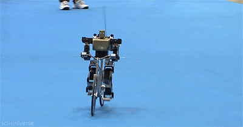
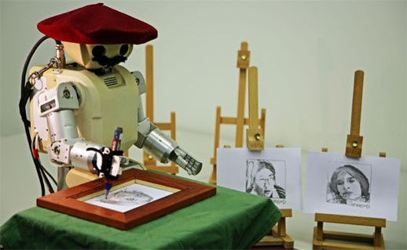
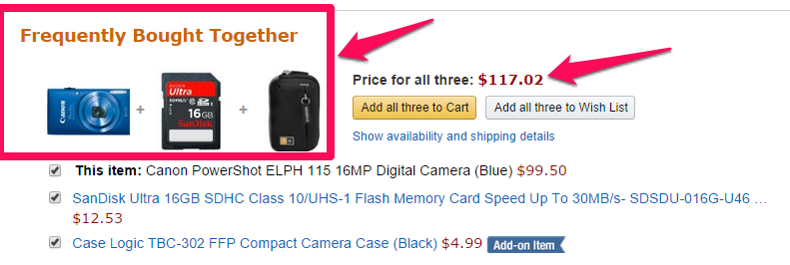
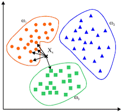
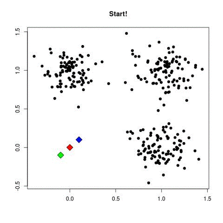
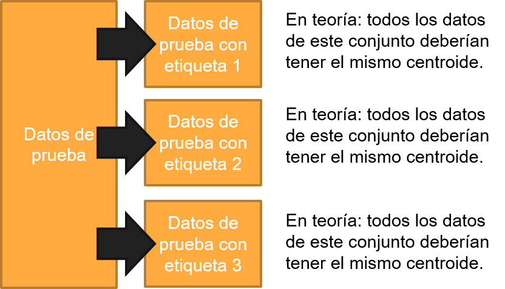
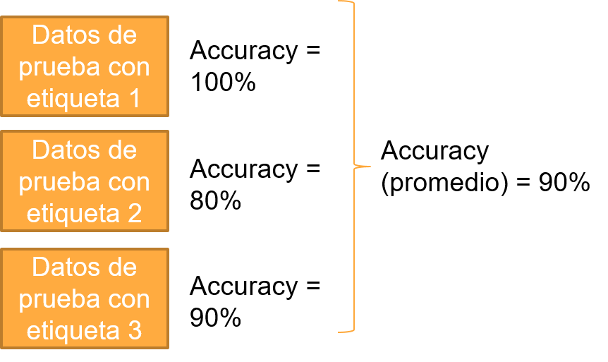
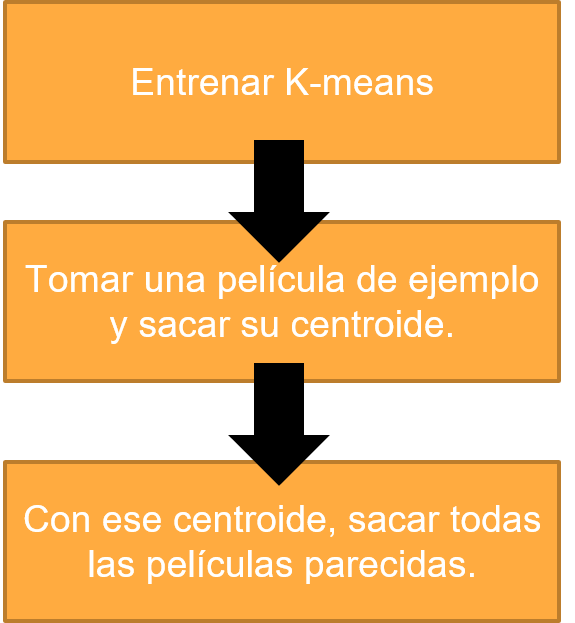

# Sesión 03: Algoritmos no supervisados  

#### Objetivo: Construir algoritmos que permitan hacer separación en conjuntos sin necesidad de suministrar datos de categorización.  

¡Bienvenido a la tercera sesión de Machine Learning! En esta sesión aprenderemos a generar algoritmos no supervisados y cómo nos pueden ayudar a resolver problemas específicos. 

Lo primero que necesitamos es conocer un poco de los fundamentos de los algoritmos no supervisados, y una vez teniendo los fundamentos fijos, podemos intentar unir problemas que se nos presentan con estos algoritmos. 

## Fundamentos de algoritmos no supervisados

Para entender qué son los algoritmos **_no supervisados_** primero debemos de partir de su contraparte, los algoritmos **_supervisados_**: Un algoritmo supervisado significa que sabemos exactamente cómo queremos que se comporte nuestro sistema: Sabemos qué entradas le entregamos, y también sabemos qué salidas esperamos que tenga. 

Un ejemplo interesante de un algoritmo supervisado (que nada tiene que ver con machine learning) es _andar en bicicleta_: Cuando aprendes a andar en bicicleta, tienes una clara noción de lo que quieres lograr (en este caso, desplazarte con la bicicleta) y las caídas y raspones que te das intentándolo se vuelven parte del entrenamiento: poco a poco tratas de caerte menos, hasta que andar en bicicleta se vuelve parte de tu conocimiento. 

En cambio, un **_algoritmo no supervisado_** es el equivalente de una tarea que requiere creatividad: Como en casi todas las actividades creativas, no hay una manera (objetiva) de que alguien te diga que la actividad que estás realizando está mal hecha. Un ejemplo de ello es pintar artísticamente: tienes una idea vaga de lo que deseas obtener, pero hasta que estás pintando empieza a tomar forma el resultado. 

En resumen:
- Si tu problema tiene entradas y sabes exactamente cuál es la salida que esperas, debes implementar un algoritmo supervisado.
- Si tu problema tiene entradas, pero no tienes idea de qué deseas obtener como resultado de salida, debes implementar un algoritmo no supervisado.

### ¿De qué me sirve un algoritmo no supervisado?

Un algoritmo de ML no supervisado te puede dar información sobre datos parecidos. Por ejemplo:

- Contenidos similares: Dependiendo de lo que busques en Facebook o Instagram, o de lo que pases mucho tiempo viendo, los algoritmos de ML no supervisados procurarán mostrarte más contenido de ese tipo.
- Problemas parecidos: Si tienes muchos casos de estudio parecidos y tienen información mapeable, puedes presentar un caso de estudio y el sistema debe traerte varios parecidos y con ellos, la solución. Sistemas expertos pueden nacer de esta noción.
- Clientes que se comportan similarmente: Si tienes dos clientes con patrones de consumo similares, eso quiere decir que lo que compre un cliente el otro probablemente también lo desee.
- Detección de anomalías: Si tienes un cluster de comportamiento “normal”, y una acción está muy lejos del centroide (mas allá de cierto umbral) es probable que sea una anomalía.
- Detección de fraudes bancarios: Un fraude bancario puede detectarse de forma relativamente fácil: un patrón inusual en una cuenta bancaria probablemente es un fraude: Por ejemplo, una transacción en un lugar extraño, una cantidad extraña, una hora de operación extraña…

Sin embargo, no todo es maravilloso con los algoritmos no supervisados: Los resultados podrían no ser lo que esperabas, ya que el algoritmo decide cómo va a categorizar los datos. Las clases (o clústers) podrían no ser como tú las defines, o bien, cada que ejecutes el algoritmo de entrenamiento puede que obtengas resultados diferentes. 

### Algoritmo no supervisado: K-Nearest-Neighbors

Entre los algoritmos más comunes se encuentran los *K-Nearest-Neighbors* (K-vecinos mas cercanos), que consiste en que tomas un dato nuevo y lo comparas contra todos los demás puntos (¿Recuerdas la distancia euclidiana de las sesiones pasadas?).

Ordenas las distancias de la más pequeña a la más grande y conservas solamente las **K** distancias mas pequeñas. Esas **K** distancias votan para elegir a qué grupo pertenece tu nuevo dato. 

Por ejemplo, mira esta gráfica en donde tu nuevo dato es **X**:

Extrayendo las 5 distancias mas cercanas, podemos ver que 4 pertenecen al conjunto naranja y 1 al conjunto verde. Dada esta votación entre verdes y naranjas, concluímos que **X** pertenece al conjunto naranja.

Una de las desventajas de utilizar K-nearest-neighbors es que tienes que calcular la distancia euclidiana contra todos los puntos de tu dataset. Esto puede ser muy complicado, sobre todo si manejas millones de datos. Además de ello, tienes que ordenarlos de menor a mayor para obtener solamente los *K* datos más cercanos. Por estos problemas, no implementaremos ahora mismo *K-Nearest Neighbors*. Sin embargo, es importante que sepas que existe este algoritmo y que con estas instrucciones puedes implementarlo por tu cuenta. 

### Algoritmo no supervisado: K-Means

A diferencia de K-nearest-neighbors, k-means (también llamado K-medias) es muchisimo mas eficiente computacionalmente, y te da resultados igual de buenos que K-nearest-neighbors, por lo cual trabajaremos sobre este algoritmo. 

Para empezar a definir el algoritmo de k-means, tenemos que partir del concepto de _centroide_: Un centroide es una representación promedio de cada uno de los grupos que quieres obtener. Por ejemplo, si quieres dividir a tus clientes en tres tipos (digamos: tipo rojo, tipo verde y tipo azul), el centroide será la representación "ideal" de cada uno de los tipos.

Lo primero que haremos será colocar los centroides (que en este caso los representaremos como diamantes) en cualquier lugar, algo así: 

A partir de este paso inicial, haremos los siguientes pasos: 

1. Tomaremos todos los puntos, y por cada punto, calculamos cuál es el centroide más cercano. Cada punto pertenece al grupo del centroide mas cercano. 
2. Cuando todos los puntos tienen un grupo asociado, separamos los puntos en grupos (grupo rojo, grupo azul y grupo verde).
3. Sacamos el promedio de todos los datos del grupo rojo y movemos el centroide al valor promedio del grupo rojo. 
4. Sacamos el promedio de todos los datos del grupo verde y movemos el centroide al valor promedio del grupo verde. 
5. Sacamos el promedio de todos los datos del grupo azul y movemos el centroide al valor promedio del grupo azul. 
6. Repetimos todos los pasos hasta que todos los centroides dejen de moverse (o se muevan muy poco). 

Este proceso se ve más o menos así:

Una vez que el algoritmo termine, todos los datos tendrán una clase o grupo asociado, lo que quiere decir que todos los datos del mismo grupo son similares. Si un nuevo dato llega, puedes asociarlo a alguno de los K centroides, y a diferencia de K-nearest neighbors, sólo tienes que calcular K distancias, en lugar de calcular la distancia contra todos los datos.

Es importante elegir adecuadamente la cantidad de grupos (K) que necesitas: Si eliges *K = 1*, todos los datos pertenecerán al mismo conjunto y no servirá de nada el algoritmo. Si eliges *K = Número de datos*, todos los datos tendrán su propio centroide y tampoco servirá de nada. 

### Librería de utilidades

El algoritmo de K-medias solamente clasifica, pero es nuestro deber interpretar los resultados. Para ello necesitaremos crear una librería auxiliar que:
- Compare un dato (una muestra) contra todos los centroides. 
- Determine a qué grupo pertenece esa muestra.
- Repita ese proceso para todas las muestras que le demos.

## Reto 01:
> Programa una librería que haga las siguientes funciones:
1. Una función que calcule la distancia euclidiana de un punto contra todos los centroides. Para ello, utiliza la función np.normv(muestra-centroide)
2. Una función que obtenga el índice del centroide mas cercano con np.argmin(distancias)
3. Usando las funciones del paso 1 y 2, crea una función que los repita para cada uno de los puntos de un dataset.
4. (Extra): Haz celdas que prueben que todas las funciones operen como esperas.

Una vez que lo consigas, puedes comparar con la solución del reto 01 [aquí](Reto01/Reto 01.ipynb)

## Entrenamiento de K-means: Obteniendo los centroides

La sesión pasada nos dedicamos a separar datos en entrenamiento y prueba: En este caso utilizaremos la misma separación del dataset en 60% de entrenamiento, y 40% prueba. 

Una pregunta válida es: "¿Por qué necesitamos salidas de entrenamiento y prueba si el algoritmo es no-supervisado?" Realmente no necesitamos las salidas, pero podemos aprovecharlas para ver qué tan bien se agrupan los datos en clústeres. 

Podemos ver un ejemplo del entrenamiento de K-medias en [este cuaderno](Ejemplo01/Ejemplo 01.ipynb) 

Una vez que hemos entrenado el algoritmo de K-medias y obtuvimos los centroides, vamos a probar que los datos con cada etiqueta estén agrupados en el mismo centroide:

Para ello, separamos los datos de prueba en K clases (dependiendo del valor “Y” esperado). En teoría, todas las muestras de una misma clase “Y” deberían tener el mismo centroide.

El calcular el accuracy por cada conjunto de prueba y luego hacer el promedio es válido si todos los conjuntos de prueba tienen la misma cantidad de muestras; si no es así, se tienen que guardar todos los errores y luego calcular el accuracy con: 

$accuracy = \frac{num\ muestras - num\ errores}{num\ muestras} \times 100$

Y luego promediar el accuracy como se muestra en este ejemplo:

## Reto 02:
> Haz funciones que: 
1. Separen los datos de prueba: que extraigan todas las muestras con una misma etiqueta. Para ello puedes usar (numpy.where)
2. Calculen el accuracy: Saca a qué centroides pertenecen los datos de una clase con el código del reto 01, luego calcula la moda de todos los resultados. Todos los resultados que salgan de la moda son considerados errores. 
TIP: Puedes utilizar [esta función para calcular la moda](Ejemplo02/Ejemplo02.ipynb)

La solución del reto se encuentra [aquí](Reto02/Reto 02.ipynb)

## Sistemas de recomendación por K-means

Durante esta sesión hemos ido creando varias funciones en una librería de Python (que puedes encontrar como [MLUtilities.py](Ejemplo03/MLUtilities.py)), que incluye calcular la distancia euclidiana, encontrar el centroide mas cercano, clasificar por centroides, separar datos, obtener la moda, y obtener el accuracy del algoritmo de K medias.

¡Utilizando estas funciones en una sola librería, podemos crear un sistema de recomendaciones! Un sistema de recomendaciones aprende de lo que consumes y te recomienda cosas que podrían gustarte. Industrias completas dependen de esta clase de sistemas, como por ejemplo Netflix.

Para construirlo, primero entrenaremos un algoritmo de K-means para obtener un centroide por cada categoría de película. Luego tomaremos una película que el usuario "haya visto" y sacaremos su centroide. Y finalmente, con ese centroide, traeremos todas las películas parecidas. 

Puedes ver todo el proceso de creación del sistema de recomendación en [este ejemplo](Ejemplo03/Ejemplo03.ipynb)
