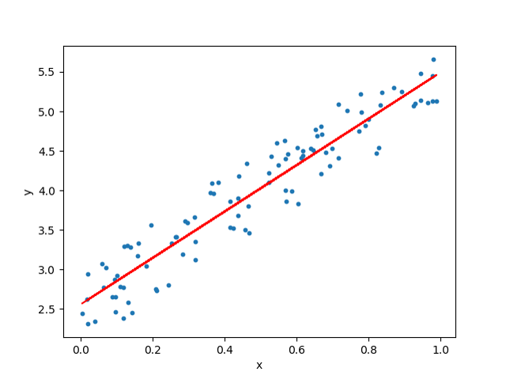
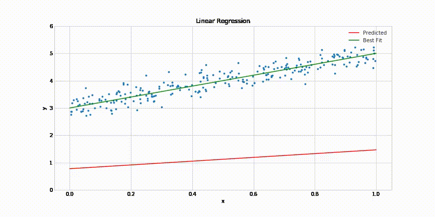
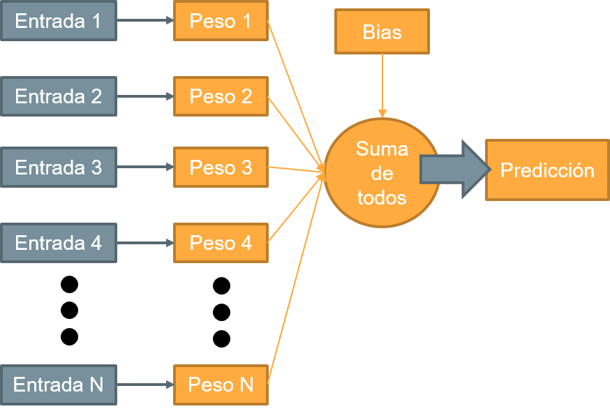
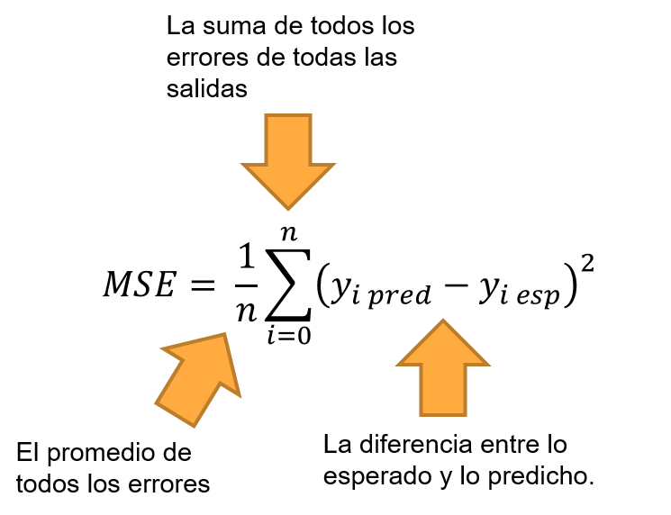
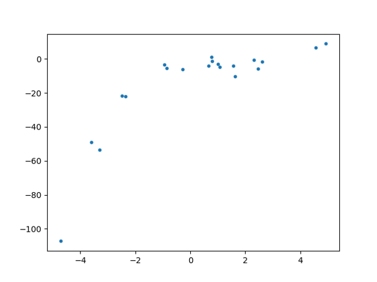
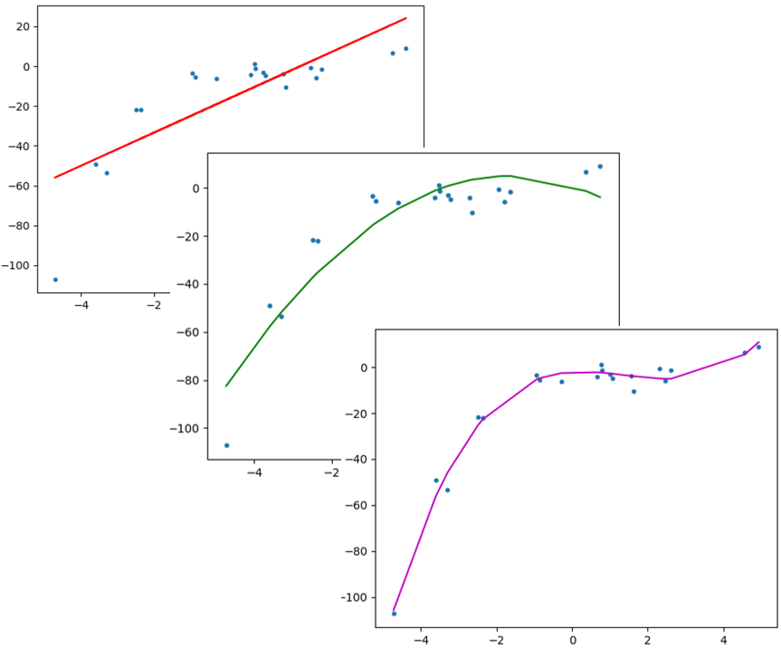
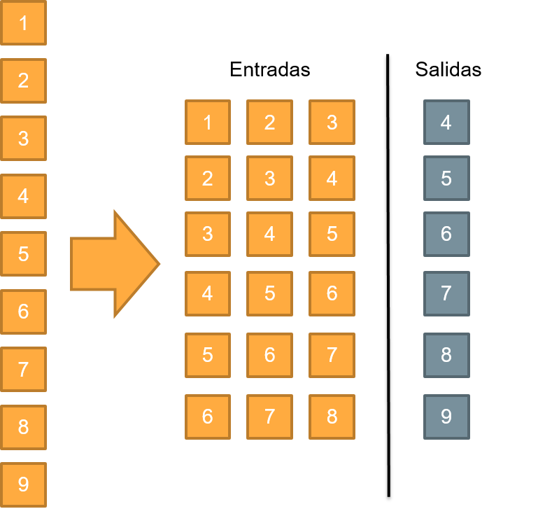
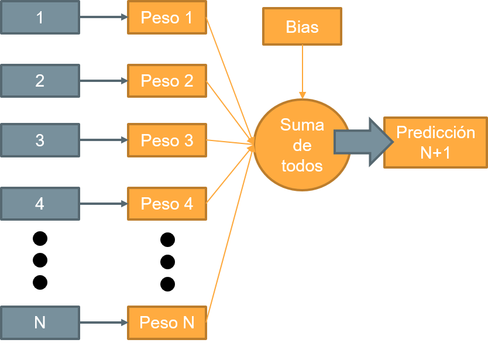

# Sesión 04: Problemas de regresión 

#### Objetivo: Construir algoritmos que permitan predecir comportamientos, tanto en series de tiempo como con características, por medio de regresores lineales y polinomiales.  

¡Bienvenidos a la Sesión 04! En esta sesión platicaremos acerca de las predicciones por medio de regresión y lo abordaremos como un entrenamiento supervisado. Para ello, lo primero será definir qué es la regresión. 

## Regresión Lineal

Veamos un ejemplo sencillo y a partir de él construyamos las definición de regresión: Sabemos bien que las horas de estudio y las calificaciones de un examen tienen mucho que ver: A mayor cantidad de horas de estudio, mejores calificaciones podrías tener en un examen. 

En este ejemplo, la variable independiente es las horas de estudio. Esas quedan a tu elección. Tú decides cuántas horas dedicarle. Y la calificación del examen es la variable dependiente: su resultado *depende* de las horas que hayas dedicado a él.

Sin embargo, no existe una fórmula matemática que te diga con exactitud: *"Si estudias 4 horas y 18 minutos tendrás un 8.6 de calificación"*. Aquí es donde la regresión lineal actúa.

La regresión lineal es usada para tratar de crear una función matemática que relacione una (o varias entradas) con una salida. Un regresor lineal podría (hipotéticamente hablando) hacer esa relación entre horas de estudio y calificaciones.

Dejando de lado los exámenes y las calificaciones, la regresión tratará de hacer una relación entre los valores de entrada y los valores de salida: nos sirve cuando no es fácil (o no existe) una manera matemática de obtener un resultado. 

Si la función está bien definida, es muy fácil obtener una regresión. Por ejemplo, la tabla del 2 es una función bien definida. Tampoco tiene demasiado caso obtener una regresión para la tabla del 2. Pero si la función no existe, o se obtiene estadísticamente, puede que sea mas difícil ser más preciso, como es por ejemplo la relación actividad física / salud; o la relación Dólar / Peso Mexicano. 

Una regresión se puede ver como esta gráfica: Los puntos azules son datos que obtienes estadísticamente y la línea roja es la estimación (o regresión) que mejor se adapta a predecir esos puntos azules.

Recordando un poco las clases de geometría de la secundaria, en la regresión lineal intentaremos construir una línea recta, que se acerque lo más posible a los puntos, para reducir al mínimo posible los errores de predicción. Al obtener los coeficientes adecuados, podemos hacer un mapeo entre un dato y un resultado esperado, y si es un problema estadístico entre mas datos de entrenamiento tengas, mejor. 

## Algoritmos supervisados: Ventajas y desventajas

Dado que este es el primer algoritmo supervisado que vamos a tratar, hay que ver algunas ventajas y desventajas de los algoritmos supervisados. 

**Ventajas:**
- Los datos que esperas y los que obtienes se parecen mucho.
- No tienes que hacer comparativas después de entrenar: a diferencia de los algoritmos no supervisados, donde tenías que mapear la clase obtenida con la clase esperada, en los algoritmos supervisados ese mapeo lo hace el algoritmo por ti.
- Una vez entrenado un algoritmo supervisado, es muy rápido obtener resultados: casi en tiempo real. 

**Desventajas:**
- Necesitas datos de entrenamiento previamente etiquetados con la información que esperas obtener. 
- Los algoritmos están vinculados a las entradas y salidas que les entregues. Si le entregas datos de K clases, solamente podrá reconocer esas K clases y no podrá lidiar con clases nuevas. 
- Meter pocos datos te llevará a malas clasificaciones y a mínimos locales (como habíamos platicado en las sesiones anteriores).

## Aplicaciones y fundamentos de entrenamiento

La regresión tiene un montón de aplicaciones en varias áreas, por ejemplo: 
- Predicción de ventas y desempeño
- Análisis del clima
- Análisis de precios y promociones
- Estimación de retornos de la inversión 
- Análisis de portafolios financieros
- y un largo etcétera...

Para entender cómo es que puede aplicarse a áreas tan dispares sin tantos problemas, es importante enteder la estructura del regresor, para ello veamos el siguiente diagrama: 

Un regresor lineal recibe de entrada los datos que tu desees, y obtiene de salida algún dato que te interesa saber. Para mapear de una (o varias entradas) a una determinada salida, hay que ajustar los pesos sinápticos (marcados como pesos) y un valor llamado "bias" (que permite ajustar la línea).

Entonces, para obtener una herramienta que te ayude a predecir de un dato a partir de otros, lo que tienes que obtener son los pesos sinápticos correctos. El primer paso para obtener los pesos sinápticos consiste en saber qué tan equivocados estamos. Cuando sepamos eso, podemos corregir los pesos sinápticos como un descenso en gradiente. 

## Errores y ajustes de pesos sinápticos

Cuando hacemos la tarea de clasificación, utilizamos positivos verdaderos, negativos verdaderos, falsos positivos y falsos negativos. Sin embargo, eso es útil en clasificación, mas no en predicción. 

Para calcular qué tan bueno es un predictor como el regresor lineal no utilizamos el accuracy, sino una medición llamada *Error cuadrático medio* o MSE por sus siglas en inglés (Mean Square Error). 

Si bien es cierto que utiliza una fórmula matemática, no debes temerle a ella, porque es bastante simple de entender. Si tienes **n** datos y para cada uno tienes una salida **y predicha** y una salida **y esperada**, el error cuadrático medio se calcula con: 

La razón de utilizar la función de MSE es que es derivable: recordemos que las derivadas también son un indicador de qué tanto debe ajustarse un valor para acercarse al óptimo: Una derivada muy grande significa que hay que hacer un ajsute muy grande, y una derivada pequeña significa que deben hacerse ajustes pequeños. Si la derivada es 0, quiere decir que la predicción y lo obtenido son perfectos. 

Entonces, lo primero que necesitamos es obtener la salida predicha **y pred**. Ésta se obtiene multiplicando los pesos **w** con las entradas **x** y sumándolas todas juntas con el bias **b**:

Una vez obtenido el MSE, es momento de obtener la derivada que - no te preocupes - es bastante sencilla de obtener y la coloco aquí.

No importando qué tan equivocado estés en tus predicciones, una vez obtenida la derivada, vas en camino a resolver el problema. Solamente tienes que modificar los pesos sinápticos con la derivada multiplicada por una tasa de aprendizaje "alpha": 

Alpha actúa como un término de aprendizaje: un valor de alpha grande hará que tengas cambios grandes (y quizás sea difícil llegar a soluciones precisas fácilmente), pero un alpha demasiado pequeño pequeño conllevará cambios pequeños y algoritmos lentos. Por esa razón debemos colocar un punto medio de alpha.

Sé que han sido muchas matemáticas. Por ende, es importante que dejes que estos conceptos se asienten, sobre todo si no has visto muchas matemáticas durante tu vida profesional.

## Ejemplos de predicción en costos de casas

Para empezar a tratar la predicción, vamos a utilizar un ejemplo de una empresa de bienes raíces que busca saber cuánto cuesta una casa. Su objetivo es obtener el valor promedio de las casas ocupadas (en miles de USD) y para ello ha recopilado los siguientes datos:

- **CRIM:** Tasa de crimen per-capita 
- **ZN:** Proporción de tierras para uso residenciales
- **INDUS:** Proporción de acres de negocios por pueblo
- **CHAS:** 1 si la propiedad colinda con el rio Charles, 0 si no
- **NOX:** Concentracón de ácido nítrico. (parte por 10 millones)
- **RM:** Cantidad promedio de habitaciones por vivienda
- **AGE:** Proporción de unidades construidas antes de 1940 con dueño
- **DIS:** Distancias a 5 centros de empleo de Boston
- **RAD:** Índice de accesibilidad a vías rápidas
- **TAX:** Impuestos por cada 10,000 USD de costo
- **PTRATIO:** Radio maestro-pupilo por pueblo
- **B:** 1000(Bk — 0.63)², donde Bk es la proporcion de personas descendientes de afroamericanos
- **LSTAT :** Porcentaje de personas de estratos bajos de la población

Y lo que desea obtener la empresa es la estimación de la variable: 

- **MEDV:** Valor promedio de casas ocupadas (en miles).

Recordemos que el regresor lineal va a predecir precios y para ello va a recibir los parámetros que le digas que reciba. Igualmente la predicción que necesites será la que especifiques, por lo que vamos a cablear el regresor de la siguiente manera: 

Para ello, vamos a realizar el entrenamiento del regresor con el siguiente [ejemplo.](Ejemplo01/Ejemplo01.ipynb)

## Reto 01:
>
> Toma el código del [ejemplo 01](Ejemplo01/Ejemplo01.ipynb) y modifica los datos de entrada: agrega, cambia o quita datos. Revisa cómo eso afecta las predicciones. También aumenta los datos de entrenamiento y reduce los de prueba; y como extra, intenta normalizar los datos para mejorar su rendimiento.

La solución del reto 01 se encuentra [aquí.](Reto01/Reto01.ipynb)

## Regresión polinomial

Hasta ahora hemos visto lo que pasa cuando tienes datos que se comportan como una línea recta. Pero ¿qué pasa cuando tienes datos que se curvean? 

Si en un plot observas un patrón curvo, quizás requieres que tu regresor se curve igualmente y para ello construiremos un regresor polinomial. Un regresor lineal tendrá muchos errores, pero un regresor polinomial de más grados (grado 2, la línea en color verde o grado 3, la línea en color morado) podría tener mejor apego a tus datos.

Así es como se ve un polinomino de primer, segundo y tercer grado. Como se puede notar, las líneas se adaptan mejor y el error se reduce. Pero es importante notar que subir el grado del polinomio también conlleva sus costos: No siempre un polinomio de mayor grado puede ser lo mejor para un problema, a veces el grado del polinomio elevado hace mas mal que bien.

Para ejemplificar esto, veamos [el siguiente cuaderno.](Ejemplo02/Ejemplo02.ipynb) Y con base en el ejemplo, hagamos el siguiente reto.

## Reto 02:
>Edita el polinomio y revisa cómo afecta las predicciones. Nota cómo un polinomio muy elevado sobre-entrenará al regresor y fallará, mientras que un polinomio muy pequeño podría no acercarse tanto a los puntos.

La solución al reto se encuentra [aquí](Reto02/Reto02.ipynb)

## Predicción de series de tiempo

Supongamos que tienes un fenómeno que constantemente cambia y no es fácil de expresar matemáticamente; por ejemplo:

- El clima
- La bolsa de valores
- Las ventas de un negocio
- El tráfico diario
- Etc…

Una serie de tiempo consiste en medir periódicamente este fenómeno. Lo importante es que el tiempo entre una medición y otra sea el mismo, esto quiere decir que tenga la misma periodicidad. Este último punto es clave: Una serie de tiempo que tiene un periodo inconsistente es inútil.

Un punto de partida importante es que la serie de tiempo debe tener la misma periodicidad siempre. Si no es así, deben quitarse los datos que no cumplen con la periodicidad. Si faltan datos deben ser extrapolados, pero eso cae dentro del tema de limpieza de datos.

Una vez que has capturado la suficiente cantidad de datos en una serie de tiempo, puedes intentar crear un predictor con regresión lineal / polinomial que tenga como entradas el periodo actual y N-1 periodos anteriores. La salida que tratarás de predecir será el periodo siguiente.

Esto puede ser sumamente útil: Si tienes un predictor funcional, puedes darle los datos de los N días anteriores y los datos de hoy; con eso puedes tratar de predecir el comportamiento para el día de mañana.

Para ello tienes que transformar los datos de tu serie de tiempo en entradas para el predictor. Por ejemplo, los datos deben venir ordenados del primero (1) al último (digamos, 9), para acomodarlos de la siguiente manera: 

Una vez transformada la conexión de serie de tiempo a datos de entrada, puedes mapear los datos de la siguiente manera: 

Puedes ver el código que genera estos pasos en [el siguiente ejemplo](Ejemplo03/Ejemplo03.ipynb) y puedes utilizarlo para mejorar las predicciones en el siguiente reto. 

## Reto 03:
>Con lo aprendido en la sesión, intenta mejorar las predicciones. Intenta con más (o menos) datos de entrada, más (o menos) datos de entrenamiento y grados polinomiales en lugar de datos lineales. 

La solución del reto se encuentra [aquí](Reto03/Reto03.ipynb)
