# Sesión 06: Redes Neuronales Artificiales

#### Objetivo: Construir una red neuronal artificial y entender los procedimientos del algoritmo de descenso en gradiente para predicción y clasificación supervisada.  

¡Bienvenido a la sesión 06 del curso de Machine Learning para Bedu Tech! En esta sesión hablaremos acerca de uno de los temas más utilizados y de mayor relevancia en Machine Learning: las redes neuronales artificiales. 

En sesiones anteriores hemos creado algoritmos de clusterización, algoritmos predictivos con un regresor lineal y algoritmos de clasificación y predicción con Random Forests. Pero enfoquémonos un poco en el regresor lineal: Para recordar, vimos que un regresor lineal puede construir funciones con múltiples entradas para darte una salida.

Sin embargo, vamos a echar un vistazo a un problema que tiene un regresor lineal: **El problema del XOR.**

## El problema del XOR

Un punto de partida importante para entender el problema del XOR es hablar acerca de cómo funcionan las compuertas lógicas con las que están construidas todas las computadoras: Como bien sabes, las computadoras trabajan con valores binarios (0 y 1) y existen compuertas lógicas que te permiten hacer operaciones sobre estos valores binarios para obtener resultados. 

Combina suficientes compuertas lógicas de forma inteligente y puedes obtener casi cualquier resultado matemático. Es por ello que son tan importantes: Los procesadores de alta gama de hoy en día no son más que la miniaturización de estas compuertas lógicas y muy probablemente esas compuertas lógicas nos acompañen durante muchos años más en desarrollos futuros. 

Casi todas las operaciones lógicas creadas con compuertas utilizan dos entradas: llamémoslas A y B. Las operaciones lógicas que puedes generar son las siguientes:

- AND: Si la entrada A = 1 y también la entrada B = 1, el resultado es 1.
- OR: Si la entrada A = 1 o bien la entrada B = 1, el resultado es 1.
- NOT: Si la entrada A = 1, la salida es 0, se le conoce como *inversor*
- NAND: También llamado NOT AND, a la salida de un AND, se le coloca un NOT.
- NOR: También llamado NOT OR, a la salida de un OR, se le coloca un NOT.
- Buffer: Lo que le entregas de entrada, te lo entrega de salida. 

y finalmente el que nos interesa: XOR, también llamado Exclusive OR, En el que: 
- Si A = 1 y B = 1, la salida será 0
- Si A = 0 y B = 1, la salida será 1
- Si A = 1 y B = 0, la salida será 1
- Si A = 0 y B = 0, la salida será 0

Estos son los esquemas de las compuertas lógicas: 

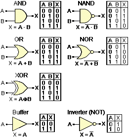

Tomemos en cuenta que los discos de estado sólido que te dan una gran capacidad de procesamiento a altísima velocidad, están construidos con compuertas NAND, que te permiten almacenar y recuperar datos rápidamente. 

En este momento podrías preguntarte: *¿Y esto qué tiene que ver con Redes Neuronales Artificiales?* Pues bien, una idea que surgió en la década de 1970 fue hacer que una neurona artificial actuara como una compuerta lógica genérica: imprimes un montón de neuronas artificiales en un pedazo de silicio, las conectas, la ajustas y listo, tienes cualquier clase de sistema multipropósito, programable y re-programable para cualquier clase de tarea.

En este caso, las primeras neuronas artificiales que comenzamos a utilizar para lograr este cometido fueron los regresores lineales. Si recuerdas, un regresor lineal trata de ajustarse para simular cualquier función. Si podemos hacer que un regresor lineal ajuste **TODAS** las compuertas lógicas, tendremos una computadora propia de la ciencia ficción...

O bien, eso creíamos. Hay un detalle: No puedes simular una compuerta XOR en un regresor lineal porque ***No existe una línea que separe un XOR en un plano cartesiano*** Para ello, observa la siguiente figura: 

Supongamos que los puntos negros representan un 1, y los puntos blancos un 0. ¿Puedes trazar una línea recta que los separe?

Por supuesto, te darás cuenta de que es imposible. Esto llevó a los investigadores de los 70s a una profunda depresión. Puedes corroborar esto en el [ejemplo 01](Ejemplo01/Ejemplo01.ipynb)

Esto llevó a muchos programadores y científicos a abandonar las redes neuronales durante los años 70s. Tomemos en cuenta de que ese camino iba a ser retomado mas adelante, pero mientras tanto, no parecía resolverse pronto. Para tratar de darle la vuelta al problema, las redes neuronales tendrían que cambiar y mejorar. Lo primero que se implementó con esa finalidad fueron las funciones de activación.

## Funciones de activación

Hasta ahora, lo que hemos visto es que un regresor lineal funciona así: 
- Tomas datos y a cada uno de ellos los multiplicas por un peso.
- Obtienes una salida "lineal". 
- Ajustas los pesos hasta obtener la salida que deseas.

El problema de ello es que el comportamiento es solamente lineal o, en su defecto, polinomial: Un problema de ello es que una neurona biológica no funciona estrictamente así. Nuestro objetivo es tratar de copiar lo mejor posible el funcionamiento de una neurona artificial. 

Echemos un vistazo a la biología, la cual es una excelente maestra.

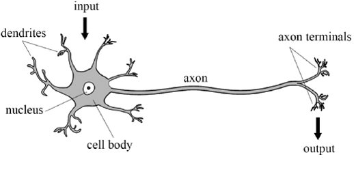

Esta es una neurona artificial. Se parece mucho al regresor lineal, si lo miras de la siguiente forma: las dendritas son entradas y se conectan a una salida llamada axón.

La salida de un regresor lineal puede ser prácticamente cualquier cosa, desde -infinito a infinito, pero sabemos bien que una neurona no puede mandar una señal infinita. En lugar de eso, el axón funciona como una salida y decide si la neurona debe activarse o no.

Para construir una neurona artificial tenemos que crear ese segmento que decida si una neurona debe pasar información o no. Para ello le conectaremos una *función de activación*: una función matemática que decidirá si una neurona se activa (da como resultado 1) o no se activa (da 0 como resultado). 

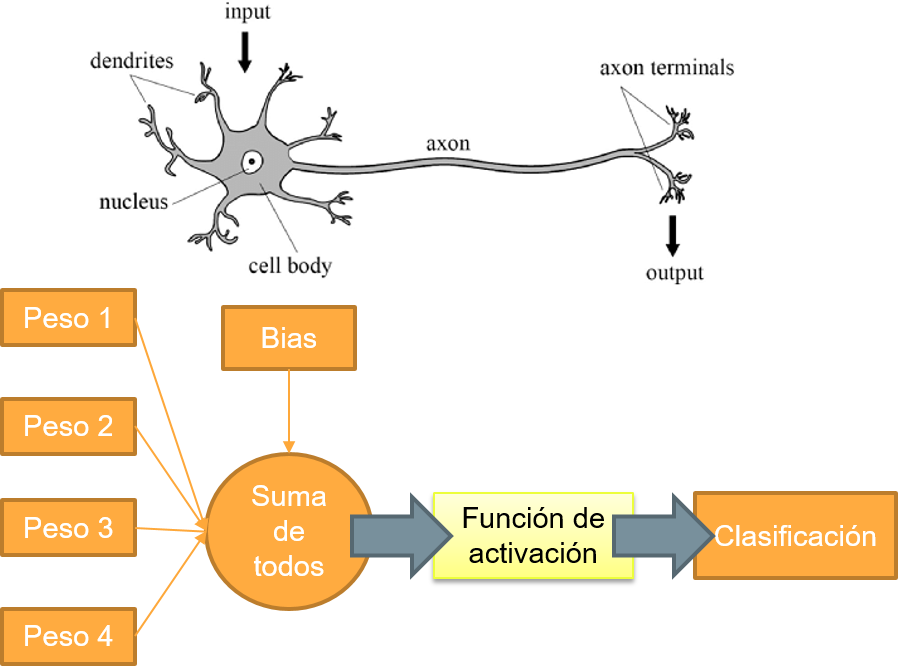

Para ello, lo primero que vamos a construir es una neurona artificial (desde cero). No te preocupes, es bastante sencillo.

## Reto 01: Crea una neurona artificial
> Para crear una neurona artificial tienes que completar tres pasos: 
   - Crea una función llamada "calcularZ", que haga lo siguiente: 
      **z = calcularZ(pesos,x,bias) = np.dot(pesos,x) + bias**
   - Luego, haz una función llamada "activacion" que por ahora será temporal y lo que reciba de entrada retornará de salida:
      **y_prediccion = activacion(z) = z**
   - Finalmente, haz una función llamada neurona, que una el paso 1 y el 2.
     **y_prediccion = neurona(activación(calcularZ(pesos,x,bias)))**
     
Puedes ver la solución al reto en [este cuaderno.](Reto01/Reto01.ipynb) 

Como nota importante, durante esta sesión crearemos una red neuronal desde cero. Sin embargo, al final de la sesión haremos el entrenamiento con SciKit Learn. **Es sumamente importante aprender a construir una red neuronal para entender cómo mejorarla.**

## Programando funciones de activación

Ahora mismo tenemos una función de activación simple, que recibe de entrada un valor Z y retorna el mismo valor de salida:

g(z) = z

Sin embargo, lo que nosotros necesitamos es una respuesta binaria (0 para no, 1 para si). ¿Qué pasaría si requerimos una respuesta binaria? Nosotros podemos editar esta función de activación para que tenga el resultado que nosotros necesitamos. 

La primera función que podemos programar se llama **_Función sigmoidal_** y te permite generar valores de probabilidad, o bien, valores entre 0 y 1. Si la red neuronal tiene la certeza absoluta de un valor positivo, te dará un 1. Si la neurona tiene la certeza absoluta de un valor negativo, te dará un 0. Si no está del todo segura, te dará un valor de 0.5 .

La funcion sigmoidal se ve así:
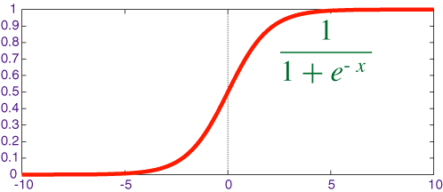

Como puedes notar, con valores muy muy grandes de entrada lo más que te puede dar una función sigmoidal es 1. De igual manera, con valores muy grandes (negativamente) lo que te entrega la función sigmoidal es 0. 

Una variante que puede serte útil se llama *tangente hiperbólica*, que te entrega valores de -1 a 1: negativos para casos falsos y positivos para casos verdaderos. La gráfica es así:

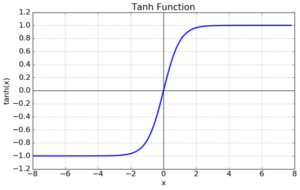

Tanto la función sigmoidal como la tangente hiperbólica puedes observarlas en [el ejemplo 02.](Ejemplo02/Ejemplo02.ipynb)

Una de las razones importantes de usar una función de activación como la sigmoidal o la tangente hiperbólica es que *son derivables*: toda función de activación debe ser derivable ya que si no es así, no hay manera de ajustar una neurona. Recordemos que las derivadas nos dicen qué tanto debe cambiar un valor de una neurona y nos ayudan a determinar cómo cambiar los valores. 

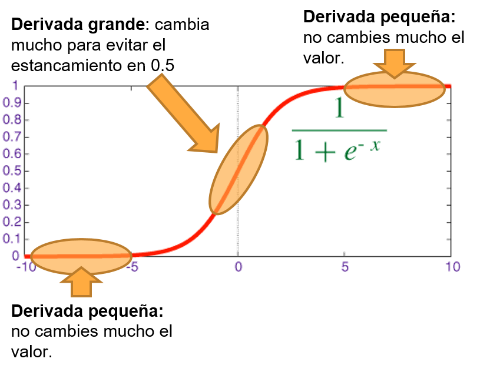

No te preocupes demasiado por las matemáticas; me interesa mas que tengas las nociones de por qué debemos utilizar una función que tenga derivada. Hay funciones que serían excelentes funciones de activación pero no se pueden derivar, como la función escalón.

## NumPy y Redes Neuronales

Ahora mismo, con el Reto 01 hemos creado una sola neurona. Sin embargo, una red neuronal en realidad tiene múltiples neuronas e incluso múltiples capas entre las neuronas, como puedes observar en la siguiente imagen:

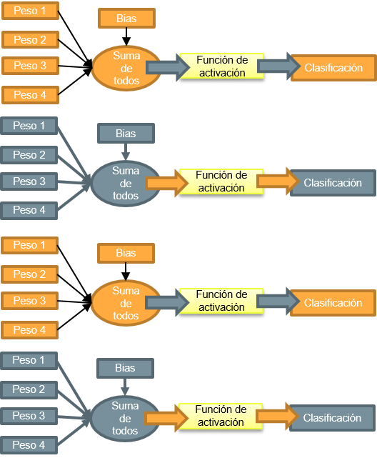

Sin embargo, programar una red neuronal, neurona por neurona, puede ser leeeento y extenuante. Por ende, NumPy nos puede ayudar a hacer esta misma tarea en un solo paso:si tienes una neurona artificial ya programada y múltiples entradas numpy.dot puede hacer que las entradas se mapeen directamente con los pesos sin que tengas que programar nada más.

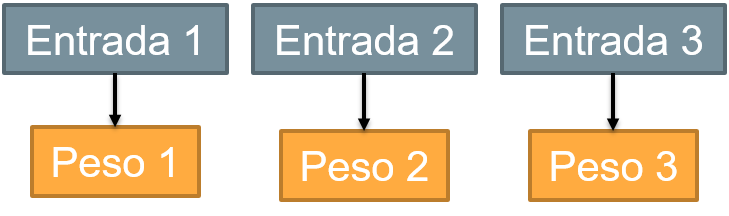

Recordando lo que hablamos en el Prework de esta sesión, el producto punto que implementa np.dot te puede ayudar a conectar filas con columnas: Como no podemos conectar filas con filas, necesitas hacer una transposición de la matriz. En otras palabras, sacar la matriz transpuesta de los pesos W, para que se conecten de esta manera:

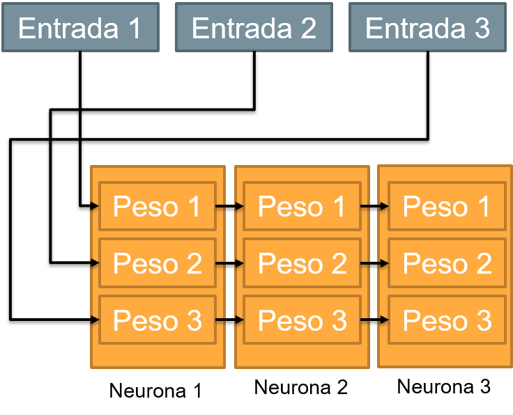

Para ver cómo se puede programar esto, por favor [revisa este ejemplo.](Ejemplo03/Ejemplo03.ipynb) Como puedes notar, ¡las funciones que ya has programado en el Reto 01 sirven perfectamente! A NumPy le da igual si usas una o mil neuronas en una capa. Lo único que hicimos fue cambiar el nombre de la función de "neurona" a "capa neuronal".

## Reto 02
> Para poder utilizar adecuadamente una red neuronal, primero tenemos que crear una función que la inicialice con valores aleatorios. La función debe de:
 - Recibir de entrada el tamaño del vector X y el número de neuronas que quieres implementar.  
 - Retornar de salida una matriz de pesos W, **con números aleatorios** y un array de bias B, igual **con números aleatorios.**
 
Puedes ver el resultado del [Reto 02 aquí.](Reto02/Reto02.ipynb)

Con lo que hemos programado en los dos retos (el Reto 01 y Reto 02), ahora mismo hemos creado una sola capa de neuronas. Todas las neuronas de esa capa buscan una misma solución. Sin embargo, todas las neuronas de esa capa son independientes y no se comunican entre sí. 

A diferencia de los random forests, una red neuronal podría verse beneficiada de que cada una de las neuronas se comuniquen para que combinemos los resultados.

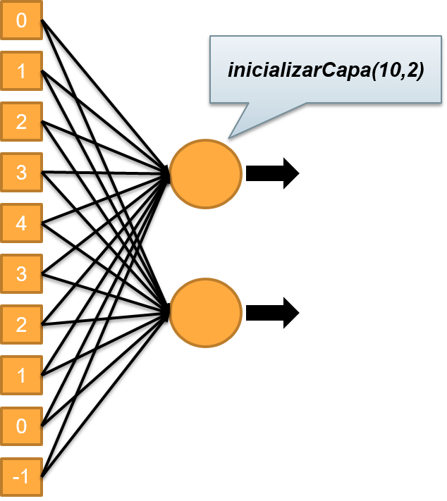

Para hacer la comunicación, podemos crear una segunda capa neuronal que recolectará las decisiones de la primera capa y utilizará los datos para tomar la decisión, de la siguiente manera: 

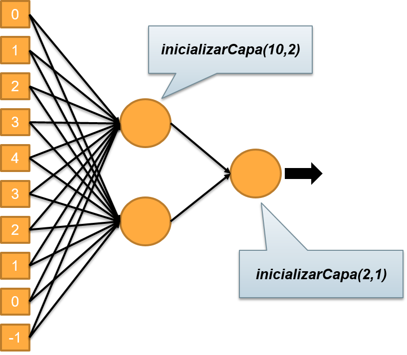

Podemos ver cómo se programa esto en [el ejemplo 04](Ejemplo04/Ejemplo04.ipynb) en donde podemos ver cómo cuando combinamos varias capas de neuronas podemos darle la vuelta al problema del XOR: Más neuronas trabajando juntas en varias capas, pueden construir comportamientos más inteligentes.

## Clasificación con Redes Neuronales

Dejando de lado el problema del XOR que solucionamos en el ejemplo anterior, podemos echar a andar una red neuronal como un clasificador que aprende de manera supervisada. Ya podemos definir la cantidad de capas de entrada, la cantidad de capas, y tenemos que definir también la capa de salida. 

En el caso de la clasificación binaria (verdadero / falso) podemos decantarnos por dos opciones: utilizar una neurona para que sirva como bandera booleana (0 / 1) o bien, podemos utilizar una salida *one-hot*: Dos neuronas que se activan por separado: una se activa y la otra no. 

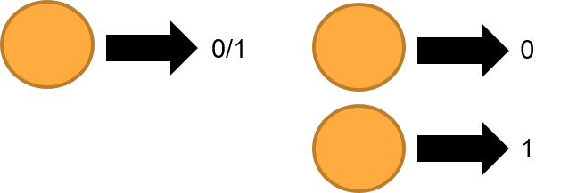

Las redes neuronales igualmente pueden clasificar para múltiples clases. Una salida codificada como un número binario, o bien una salida *one-hot* en la que solamente el número de neurona de la clase se activa, de la siguiente manera: 

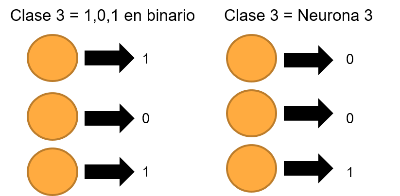

En recomendación profesional, te sugiero utilizar las salidas *one-hot* ya que son mas fáciles de entrenar y entregan mejores resultados. Para ver el ejemplo de este caso para un entrenamiento binario, puedes ver [el ejemplo 05.](Ejemplo05/Ejemplo05.ipynb)

## Reto 03:
>Con lo aprendido en el ejemplo 04 y 05, construye tu propio clasificador multiclase. Genera blobs de varias clases (por ejemplo, 4 clases diferentes) y crea una estructura neuronal. Te recomiendo poner tantas salidas como clases. Al final, evalúa sumando la diagonal de la matriz de confusión con np.trace

Puedes ver la solución de este reto [aquí.](Reto03/Reto03.ipynb)
