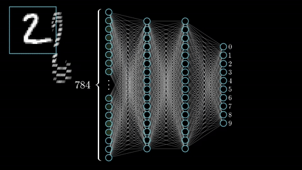
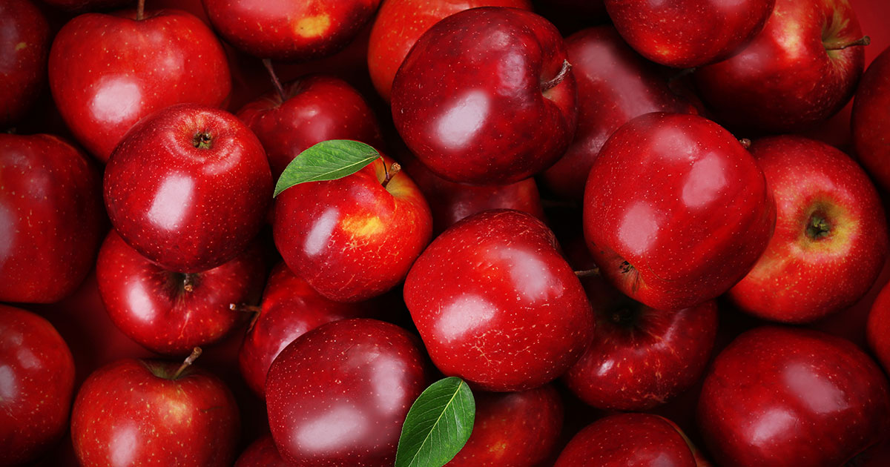

# Sesión 07: Arena de clasificadores

#### Objetivo: Construir múltiples clasificadores para diferentes problemas, hacerlos competir y seleccionar el mejor dependiendo del problema a enfrentarse.  

¡Bienvenido a la sesión 07 del curso de Machine Learning para Bedu Tech! En esta sesión hablaremos acerca de un tema importante y esencial en todos los trabajos que tienen que ver con Machine Learning; esto es: crear una arena de clasificadores. 

Lo primero que necesitaremos es tener muy fresca la sesión 02, ya que la estaremos utilizando un montón. Si eres como yo, que tengo memoria volátil, puedes consultar las funciones que hemos creado en la sesión 02 en cada uno de los retos y ejemplos de esta sesión.

Sin mas preámbulos, comencemos con el tema. 

## ¿Cuál es el mejor clasificador?

Hasta ahora hemos visto Random Forests y Redes Neuronales Artificiales, sin embargo, existen una enorme cantidad de clasificadores que operan de forma diferente. No te preocupes, veremos muchos de ellos en esta sesión - no tan profundamente como los dos primeros, pero sí platicaremos de ellos. 

A la pregunta de "¿Cuál es el mejor clasificador?" la respuesta siempre va a ser: **No lo sabemos.** Esto es porque cada uno de los clasificadores funciona de mejor o peor manera frente a determinado problema. Por ejemplo: Una decisión simple que podrías programar con *if / else* puede que la implemente mejor un random forest (dado que los random forests crean *if / else* a montones) que una red neuronal (dado que una red neuronal necesita múltiples muestras).

También tenemos que entender un concepto importante, y esto es la **heurística**. Si buscamos en internet lo que significa, veremos que dice algo como: 

>En ingeniería, una heurística es un método basado en la experiencia, que puede utilizarse como ayuda para resolver problemas de diseño [...] Dado que las heurísticas pueden equivocarse, es fundamental conocer los casos en los que son aplicables y los límites de su uso. En general, en la ingeniería deben considerarse como ayudas o apoyos para hacer estimaciones rápidas y diseños preliminares, pero no como justificaciones finales de un diseño o proyecto u otros.

En otras palabras (mas fáciles de digerir y sin tanto meollo): **La heurística es un proceso en el cual no puedes saber si has tenido éxito o no, hasta que lo lleves a cabo.** Y los algoritmos de Machine Learning son heurísticos por naturaleza: hasta que no entrenas uno y lo pruebas, no sabes si hace la tarea que esperas. 

Esto es súmamente importante, porque no existe un clasificador universal que sea el mejor para cada problema. A cada problema quizás debas probarle tres o cuatro clasificadores, evaluar cada uno, y ver cuál soluciona mejor el problema. 

## Entonces... ¿Cómo elijo un clasificador?

Muchas veces el mismo problema puede que nos dé indicios de qué clasificador se le ajusta mejor. Por ejemplo: 
- Si tienes muchos datos y quieres separarlos aunque no tienes idea de las categorías que necesitas, un clasificador no supervisado es tu elección primaria. Por otro lado... 
- Si los datos que manejas parece que no tienen relación alguna con la salida, puede que una red neuronal te ayude a encontrar correlaciones ocultas. 
- Si los problemas que estás manejando podrías separarlos con una o varias condicionales, entonces quizás un Random Forest sea tu mejor decisión. 

Lo mas importante es que no te cases con un solo clasificador. Puede que tengas idea de que uno te solucionará el problema, pero no está de más probar con tres o cuatro, para ver cuál te funciona mejor. 

Habiendo dicho lo anterior, vamos a ver varios clasificadores para ver cuál se adapta mejor a tus problemas. A partir de este punto asumiré que nos decantaremos por **clasificadores supervisados**. Si requieres un clasificador no-supervisado, puedes utilizar K-medias o K-Nearest Neighbors, como lo vimos en la sesión 03.

## Clasificador 1: árboles de decisión y random forests.

Ya hemos visto cómo funcionan los random forests en sesiones pasadas, por lo que tocaremos muy superficialmente el tema de ellos. Este es el clasificador más simple que abordaremos y veremos dónde sirve mejor. 

***Ventajas de un Random Forest***
- Fácil de implementar
- Fácil de entender cómo funciona
- Fácil de probar en resultados

***Desventajas de un Random Forest***
- El índice GINI puede hacer que un árbol de decisión sea incapaz de realizar generalizaciones, por lo que podrías necesitar entrenar muchos árboles en un Random Forest. 
- Si tienes muchas variables y muestras, los árboles de decisión podrían ser muy profundos y complejos, sobre todo en un Random Forest. 

***¿Cuándo es buena idea utilizar un Random Forest?***
- Cuando las variables de entrada sabes de antemano que tienen una relación directa con la salida que esperas. Por ejemplo, si estás programando un sistema de diagnóstico médico, sabes que la presencia de diabetes puede acarrear complicaciones en un paciente.

***¿Cuándo NO es una buena idea usar este clasificador?***
- Si los datos de entrada y de salida no tienen una correlación evidente, puede que no clasifique tan bien como esperas. Sin embargo, te exhorto a probar.

## Clasificador 2: Redes Neuronales Artificiales.

Igualmente, hemos visto cómo funcionan las redes neuronales artificiales. La mecánica detrás de su funcionamiento lo vimos en sesiones pasadas. Ahora nos enfocaremos en sus ventajas, desventajas y cuando funciona mejor. 

***Ventajas de una Red Neuronal Artificial***
- Puede entrenar con casi cualquier clase de dato numérico
- Gran capacidad de clasificación y predicción, cuando están bien entrenadas
- Los pesos sinápticos de las primeras capas te pueden dar un indicio de las características mas relevantes
- Generalizan excelentemente cuando están bien entrenadas

***Desventajas de una Red Neuronal Artificial***
- Con pocos datos, es posible que caigas en *overfitting* fácilmente. Necesitas tener un buen volumen de datos de pruebas para tener buenos resultados. 
- El entrenamiento puede ser lento si tu red neuronal no está lo suficientemente optimizada. 

***¿Cuándo es buena idea utilizar un Random Forest?***
- Cuando las variables de entrada parezcan no tener una correlación clara con los datos de salida. La red neuronal podría encontrar esas correlaciones ocultas con los pesos sinápticos. 
- Cuando requieras alta precisión o extender el sistema que creas a múltiples datos diferentes. 

***¿Cuándo no es una buena idea usar este clasificador?***
- Si puedes utilizar un clasificador mucho más sencillo, es recomendable que intentes primero con otro. Las redes neuronales son una herramienta de doble filo ya que el proceso de entrenamiento puede ser demasiado lento, sobre todo si otro clasificador mas rápido te da resultados satisfactorios. 

## Reto 01.
> Intenta comparar Random Forests y Redes Neuronales Artificiales. Una contra otra. MUY IMPORTANTE: Utiliza el mismo dataset de entrenamiento para ambos clasificadores y el mismo dataset de prueba, para asegurarte de que es una competencia justa. 

[Resultado del Reto 01 aquí.](Reto01/Reto01.ipynb)

## Clasificador 3: Support Vector Machine (SVM).

Este clasificador no lo hemos visto en sesiones pasadas y la razón es importante: Las matemáticas detrás de ellos son bastante complejas para que este clasificador pudiésemos considerarlo intuitivo. Sin embargo, trataremos brevemente la funcionalidad de la máquina de soporte vectorial. 

Una máquina de soporte vectorial consiste en crear un hiperplano que separe óptimamente una clase de otra. En algunas ocasiones el hiperplano se genera haciendo proyecciones de dimensionalidad superior (lo sé, no es fácil de explicar a menos que estés bien versado en matemáticas. Pero puedes observar esta imagen para que te dé una idea de lo que hablo).

El entrenamiento de una máquina de soporte vectorial no es fácil tampoco; en algunos casos requieres de utilizar ecuaciones de Lagrange. Sin embargo, nosotros no nos meteremos en matemáticas complejas, sino en problemas específicos que podamos resolver. Si deseas un ejemplo de cómo se utiliza una máquina de soporte vectorial, [puedes observarlo aquí](Ejemplo01/Ejemplo01.ipynb) (spoiler alert, no tiene absolutamente nada de matemáticas mi ejemplo. Puedes tomarlo y aplicarlo a tus problemas).

***Ventajas de una SVM***
- Al igual que las redes neuronales, puedes entrenar con casi cualquier dato numérico
- Una vez entrenado, la evaluación es sumamente rápida
- Generalizan bastante bien, quizás igual de bien que una red neuronal

***Desventajas de una SVM***
- Requieres forzosamente de una librería de SVM - si no, tendrás que programar tu propia máquina de soporte vectorial
- El entrenamiento es difícil de entender matemáticamente. Puede que no sea tan sencillo entender qué pasa tras bambalinas.

***¿Cuándo es buena idea utilizar una SVM?***
- Si tu red neuronal no te ha dado buenos resultados, quizás una SVM pueda ayudarte. 
- La SVM tiene varias opciones, como utilizar otro tipo de funciones *kernel*, que pueden darle solución a problemas complejos. 

***¿Cuándo no es una buena idea usar una SVM?***
- Si requieres implementar tu solución en un sistema limitado como un microcontrolador o un ambiente embebido, las SVM puede que sean un dolor de cabeza más que una ayuda, ya que -regresando a las desventajas- programar uno desde cero es un problema muy pesado que podrías ahorrarte usando otro clasificador. 

## Reto 02.
> ¿Puedes añadir la SVM y comparar los tres para ver que tal funcionan? Compáralos con algún dataset que tengas (o en su defecto con blobs...) y enuncia quién es el ganador en cada una de las rúbricas (por ejemplo, en especificidad gana Random Forest, pero en Sensibilidad gana SVM). MUY IMPORTANTE: Utiliza el mismo dataset de entrenamiento para los tres clasificadores y el mismo dataset de prueba, para asegurarte de que es una competencia justa. 

[Resultado del Reto 02 aquí.](Reto02/Reto02.ipynb)

## Clasificador 4: Clasificador Bayes Ingenuo (Naïve Bayes)

Por último, revisaremos un clasificador bastante sencillo y también bastante útil: un clasificador de Bayes Ingenuo, también llamado Naïve Bayes. Este clasificador se basa en la noción de que las características de un objeto contribuyen a su categorización, por ejemplo: Un objeto rojo, brillante, redondo, y de 5 cms de radio aproximadamente es una manzana. 

Se le llama ingenuo porque -como puedes inutir- hay muchísimos objetos que podrían cumplir con estas particularidades y no son una manzana. Sin embargo, es poco probable que tengas que clasificar narices de payaso o pelotas rojas de entre frutas, por lo que el clasificador Naïve Bayes puede ser una buena herramienta bastante sencilla de implementar. 

Puedes ver un ejemplo de cómo se implementa [Naïve Bayes aqui.](Ejemplo02/Ejemplo02.ipynb)

***Ventajas de un clasificador Naïve Bayes***
- Es un clasificador muy muy simple de utilizar
- No requiere de demasiado esfuerzo entender cómo funciona
- Puede ser un primer acercamiento a un problema de clasificación

***Desventajas de un clasificador Naïve Bayes***
- Es limitado y debido a su "ingenuidad" puede que no sea tan buen clasificador cuando lo comparas contra otros
- Utiliza funciones similares a campanas de Gauss: si tus datos no se parecen a una campana de Gauss, puede que no clasifique bien

***¿Cuándo es buena idea utilizar clasificador Naïve Bayes?***
- Si quieres describir objetos y tienes características, un clasificador de Naïve Bayes podría ser una buena opción
- Si necesitas hacer una prueba rápida con un clasificador simplón

***¿Cuándo no es una buena idea usar un clasificador Naïve Bayes?***
- En problemas muy complejos o robustos puede que un clasificador de Naïve Bayes se quede muy corto  es mejor utilizar otras herramientas si Naïve Bayes no te da buenos resultados. 

## Reto 03.
> ¿Puedes añadir el clasificador Naïve Bayes para comparar a todos? Compáralos con algún dataset que tengas (o en su defecto con blobs...) y enuncia quién es el ganador en cada una de las rúbricas (como en el reto 02). MUY IMPORTANTE: Recuerda utilizar el mismo dataset de entrenamiento para todos los clasificadores y el mismo dataset de prueba, para asegurarte de que es una competencia justa. 

[Resultado del Reto 03 aquí.](Reto03/Reto03.ipynb)
