# Sesión 08: Fundamentos de procesamiento de imágenes  

#### Objetivo: Desarrollar un sistema de procesamiento de imágenes con machine learning. Reconocer cómo las operaciones simples en las imágenes pueden llevar a generar descriptores robustos y complejos para la tarea de clasificación con Machine Learning. 

¡Bienvenido a la última sesión del curso de Machine Learning para Bedu Tech! En esta sesión tocaremos un tema que encadena este primer módulo del programa (Machine Learning) con el siguiente. En esta sesión trabajaremos con imágenes digitales y su procesamiento. 

La razón de que abordemos este tema es que muchas aplicaciones de Machine Learning trabajan sorpresivamente bien con imágenes digitales y, además, hoy en día todos los teléfonos pueden capturarlas, por lo que embeber un sistema de Machine Learning en un teléfono es algo 100% realizable.

## ¿Qué tienen que ver las imágenes digitales con ML?

Para entender cómo se conecta Machine learning con el procesamiento de imágenes, tenemos que entender una sutil separación, pero que es importante: La *estructuración* de datos. 

Los datos *estructurados* son aquellos que se encuentran perfectamente ordenados y puedes extraer información relevante fácilmente de ellos. Por ejemplo, si quieres predecir el clima y tienes una base de datos de temperatura, presión atmosférica, humedad, fecha, hora del día, etc. obtener una predicción podría ser relativamente sencillo. Aplicas lo aprendido en la sesión de regresión lineal, y listo. 

Sin embargo, ¿que pasa si solamente tienes una cámara apuntando al cielo? La predicción del clima ya no es tan sencilla, tienes que encontrar una manera de relacionar el estado del clima con los cuadros de video que estás observando. Esto se vuelve muchísimo más complejo. 

Esta clase de datos que no se pueden colocar directamente en una base de datos o una tabla, se le conocen com *datos no estructurados*. Lamentablemente se estima que el **80%** de todos los datos existentes en el mundo son no-estructurados. 

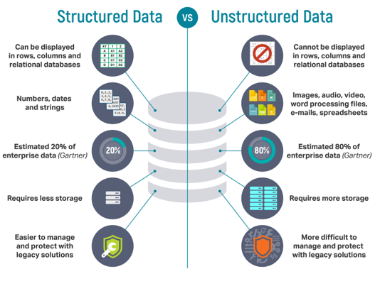

Como puedes intuir, no es fácil para una máquina entender qué es lo que hay en una imagen: Las computadoras no reconocen (al menos directamente) formas o inclusive imágenes - para ellas, una imagen no es más que una matriz de valores numéricos. 

Por ello, los programas que haremos intentarán transformar las imágenes (que no son otra cosa que matrices) en datos que tengan sentido y sean clasificables para algoritmos de Machine Learning. Este problema de transformar datos numéricos sin sentido aparente a datos que puedan ser clasificables, se le conoce como *cerrar la brecha semántica*.

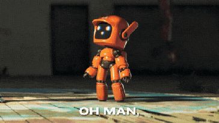

Para ello, analizaremos cómo funcionan las imágenes digitales, y cómo las podemos transformar con Python y OpenCV. OpenCV es una librería de visión computacional que tiene muchas herramientas pre-creadas que pueden ayudarte a realizar visión computacional. Sin embargo, nosotros aprenderemos aquí a hacer esas operaciones desde cero. Nuestro objeto es ayudarle a una máquina a entender qué es lo que contiene una imagen. 

## Nociones básicas de Imágenes Digitales

Una imagen digital está compuesta de píxeles en tres colores diferentes: Rojo, Verde y Azul. Cada pixel a color en cualquier pantalla está compuesto por tres pequeños LEDs que encienden con cierta intensidad. La intensidad más grande que puedes obtener es de 255 y la más pequeña es 0. Un pixel en 0 quiere decir que está apagado completamente y un pixel en 255 quiere decir que está encendido completamente. 

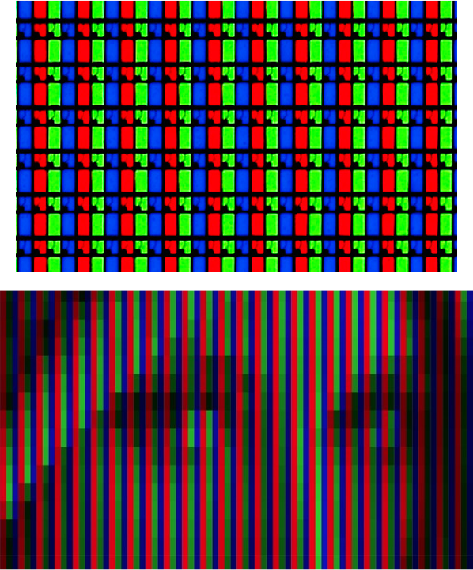

Una imagen **no es lo mismo** que un archivo de imagen. Las imágenes suelen ser enormes y los archivos de imagen tienen avanzadas técnicas de compresión para evitar llenar tu teléfono. Por ejemplo: un celular estándar puede capturar imágenes de 3264 x 1632 pixeles (con una cámara de 6 megapixeles). Si cada pixel necesita 3 bytes, el total del tamaño es de 15.24 Mb para **una sola imagen.**

Como puedes intuir, las imágenes no se guardan con los bytes puros como fueron capturados. Son comprimidas en archivos JPG, PNG y otros, que la reducen lo más posible y en algunos casos la compresión puede ser perfecta (sin pérdida alguna de calidad). 

## Estructura de una imagen. 

Hemos platicado que una imagen está compuesta de píxeles de colores rojo, verde y azul. Una imagen digital son esas tres matrices superpuestas una sobre otra. Para manipular cada una de estas matrices utilizaremos NumPy y para abrir la imagen utilizaremos OpenCV. Si no tienes la librería instalada, puedes instalarla con el comando de Pip: 

*pip3 install opencv-python*

Cuando abrimos una imagen con OpenCV, la imagen se abre en formato BGR: Primero el canal azul, luego el canal verde y luego el rojo. Por convención y de manera estándar, tenemos que transformar la imagen en formato RGB (Rojo, Verde, Azul). Esto es porque muchas veces las imágenes que manipularemos esperan que el primer canal siempre sea el rojo.

Para continuar aprendiendo a cargar y utilizar imágenes y canales, te sugiero que revises el [ejemplo 01](Ejemplo01/Ejemplo01.ipynb)

## Reto 01: 
> Toma una imagen de muchos colores (entre más colores, mejor) y re-ensámblala con los canales Rojo-verde, rojo-azul, y verde-azul, como se ve en el siguiente ejemplo: 
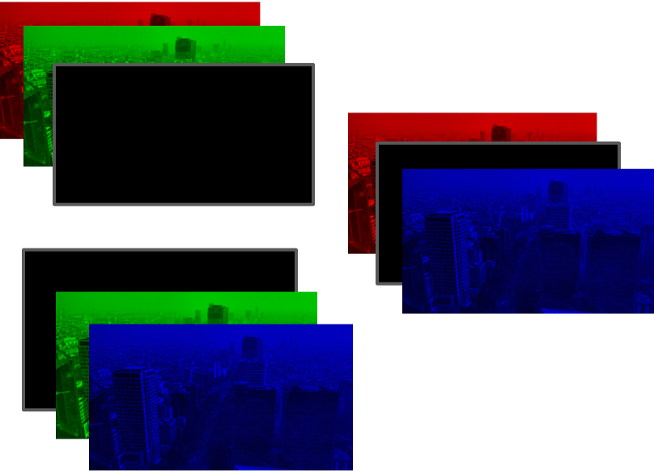
¿Qué notas al hacerlo?

Solución al [reto 01 aquí.](Reto01/Reto01.ipynb)

## Procesamiento pixel-wise

El procesamiento pixel-wise, también llamado pixel a pixel, consiste en editar todos los pixeles de la imagen de forma independente. Cada pixel se edita sin importar lo que contienen los demás, y el nuevo valor del pixel depende del valor anterior. 

A partir de este punto de la clase trabajaremos solamente con escalas de grises. ¿Por qué? Pues porque trabajar con escalas de color es exactamente igual que trabajar con escalas de grises - la única diferencia es que tendrás que hacer lo mismo para los tres canales. Con aprender cómo se hace en un canal es más que suficiente. Si deseas usar imágenes a color, hay que desensamblar, tratar cada canal por separado y luego reensamblar la imagen. 

Puedes ver cada uno de los procesamientos en el [ejemplo 02](Ejemplo02/Ejemplo02.ipynb), sin embargo te recomiendo que primero leas la explicación y luego revises los ejemplos. 

### Procesamiento pixel wise 1: Binarización 

Supongamos que tienes un robot industrial que tiene una cámara y su deber es ordenar piezas que llegan en una banda, como estos simpáticos robotcillos.

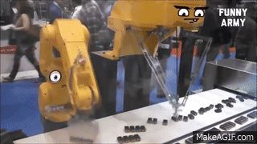

¿Has notado que las bandas industriales siempre son de un color determinado? Esto es porque al robot ordenador le interesa saber dónde se encuentra cada uno de los objetos y requiere ordenarlos de acuerdo a como fue programado. Para hacer esta distinción entre un fondo de color blanco, y objetos, se requiere llevar a cabo un proceso llamado binarización. 

La binarización consiste en que toda la imagen va a tener dos colores solamente: negro puro (0) y blanco puro (255). Los objetos pueden estar visibles de color negro, y el fondo puede ser de color blanco, o viceversa. Esto le permite a las máquinas separar el fondo de los objetos con muchisima facilidad: sólo tienen que encontrar en el mapa visual los valores de 255 (o bien 0, si los objetos son negros). 

Para generar eso, existe un umbral que un pixel debe de pasar: Si el pixel tiene un valor más grande que ese umbral (digamos, si el pixel es mas grande que 128), transformamos el pixel en blanco. Mientras que si no lo pasa, lo transformamos a negro, como se puede ver en la siguiente imagen:

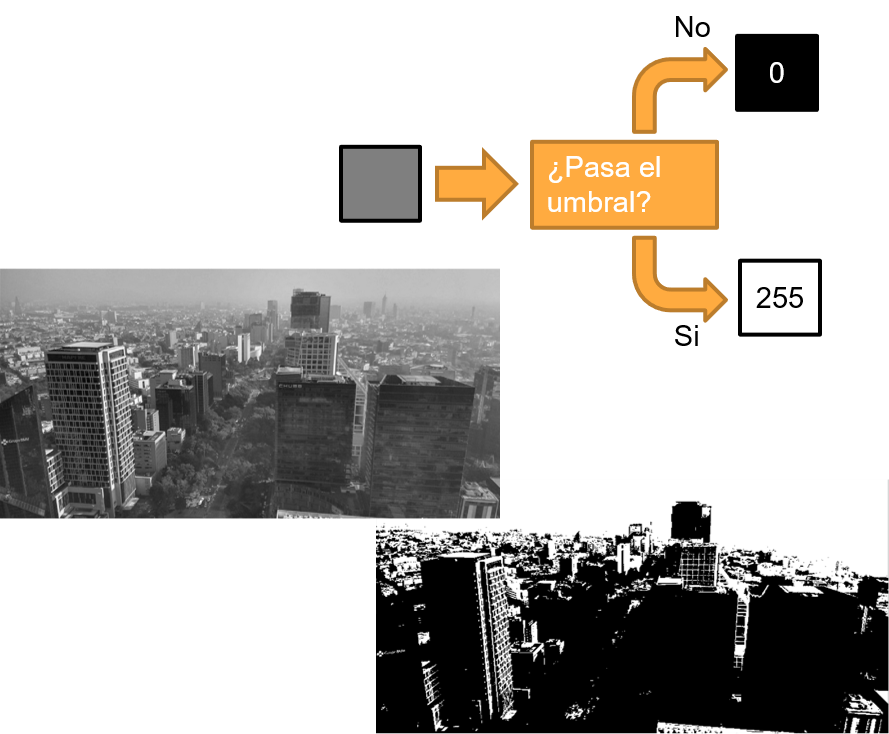

### Procesamiento pixel wise 2: Reducción de colores

Otra operación sumamente útil consiste en reducir la cantidad de colores, de tal manera que sea más sencillo para las computadoras separar objetos por colores. Para entender esto, primero hagamos unas cuentas: 

Cada pixel de cada canal puede albergar valores de 0 a 255 - en total 256 valores diferentes. Por ende, existen 256 x 256 x 256 colores diferentes (en total, 16,777,216 colores). Como a las computadoras les podría llegar a costar trabajo el procesar imágenes cuando existen 16 millones de posibilidades de color diferentes, lo que vamos a hacer será reducir el espacio de color de 16 millones a unos 10 o 20 colores (depende de la cantidad que elijas). 

Esto con la finalidad de que al tener menos colores tengas menos entradas y sea más sencillo procesar la información en forma de imágenes. Por ejemplo, si estás clasificando manzanas entre verdes y rojas, ¿de qué sirve que tengas todos los tonos posibles de rojo y de verde? con que sean rojas con un solo tono, o verdes con un solo tono, basta y sobra. 

Para reducir los colores, sólo hay que realizar un submuestreo, por ejemplo: 
- Todo color que caiga entre 0 y 63 se volverá 0
- Todo color que caiga entre 64 y 127 se volverá 64
- Todo color que caiga entre 128 y 191 se volverá 127
- Todo color mas grande que 191, se volverá 191. 

De esta manera hemos reducido el espacio de color sin mayor problema, como se ve en esta imagen. 

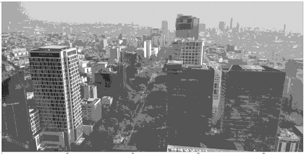

### Procesamiento pixel wise 3: Negativos.

Finalmente, una operación muy util se llama "negativo" y consiste en transformar los colores a su inverso, realizando la operación: pixel = np.abs(pixel - 255). 

Este proceso te sirve para alternar entre el fondo y el objeto: si quieres obtener ahora el fondo en lugar del objeto sin cambiar tu algoritmo, le aplicas el negativo y listo. Tu algoritmo ahora detectará el fondo. 

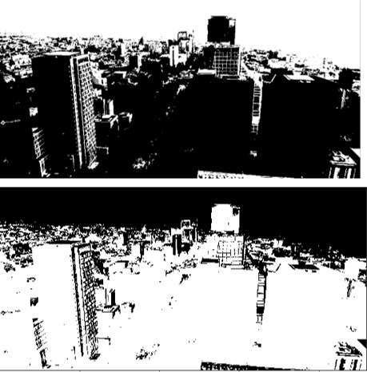

Ahora sí, ya que tienes toda la explicación completa, te invito a observar el [ejemplo 02](Ejemplo02/Ejemplo02.ipynb).

## Reto 02: 
> ¡Hagamos un segmentador que corte una imagen por ti! Con los algoritmos del ejemplo 01 y 02 y con una imagen sobre un fondo blanco, realiza lo siguiente: 1) transforma la imagen en escala de grises. 2) Binariza y genera negativos, de tal manera que los pixeles del objeto sean 1 (no 255) y finalmente 3) multiplica los canales de la imagen original contra la imagen binaria utilizando np.multiply. Esto hará que los pixeles que esten marcados con 1 se conserven y los que estén marcados con 0 se borren. 

Puedes ver el resultado del reto 02 [aquí.](Reto02/Reto02.ipynb)

## Descriptores de imágenes

Un descriptor es un resumen útil de una imagen, por lo general en términos numéricos. Por ejemplo, si nosotros presentamos la imagen de una manzana, podemos inferir características de ella, como el color, la textura o la forma. Es mucho mejor solamente tener que clasificar tres datos que toda la matriz de pixeles, que podrían no decirnos demasiado sobre el contenido. 

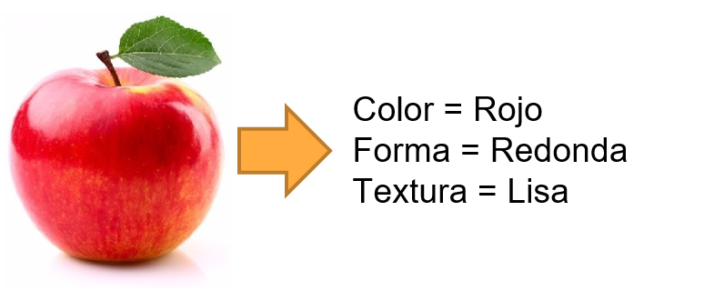

Un descriptor es una herramienta sumamente útil que se asocia comúnmente a Machine Learning, puesto que suelen ir de la mano para trabajar con clasificación de imágenes digitales: Por ejemplo: si estamos clasificando objetos parecidos como frutas, con un adecuado descriptor y un algoritmo de Machine Learning nos permitiría separar frutas rojas, redondas y lisas como manzanas. 

Es importante entender el concepto de que los algoritmos de machine learning asocian valores similares como aquellos del mismo conjunto, mientras que los descriptores trabajan bajo la noción de que los objetos que se parecen te arrojarán valores numéricos parecidos: Cuando los combinas, trabajas bajo la noción de que objetos similares tienen descriptores similares y se clasifican juntos con ML. 

Podrías preguntarte, ¿de que te sirve tener un descriptor si puedes someter las imágenes directamente a -digamos- una red neuronal? Bien, tomemos una imagen sencilla de tu celular:

- De entrada, tendrás 3264 x 1632 x 3 datos, en total 15,980,544 de bytes a procesar
- Supongamos que le colocas en la primera capa, 1000 neuronas (un tamaño estándar en aplicaciones reales)
- Tendrás que procesar: 15,980,545,000 entradas y 15,980,545,000 derivadas
- Total de datos a manejar: 31,961,090,000

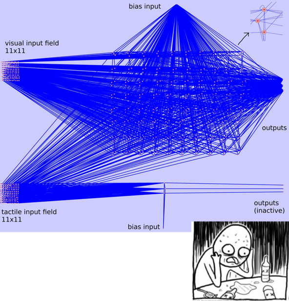

## Tipos de descriptores 

Algo interesante de los descriptores es que puedes crear tus propios algoritmos de descripción y ver si te funcionan en la práctica. Sin embargo, los descriptores por lo general se agrupan en alguna de estas tres clases:

- Descriptores de color: te dan información de qué colores se encuentran en una imagen, por lo general de forma numérica. Son utilizados en controles de calidad por lo general. 
- Descriptores de textura: te dicen si la textura es lisa o rugosa, y si la rugosidad tiene cierta dirección. Sumamente utilizado en imágenes satelitales. 
- Descriptores de forma: con valores numéricos te dicen qué forma tiene un objeto. Estos descriptores pueden utilizarse en muchas herramientas médicas, sobre todo en patología para detectar formaciones anormales de células. 

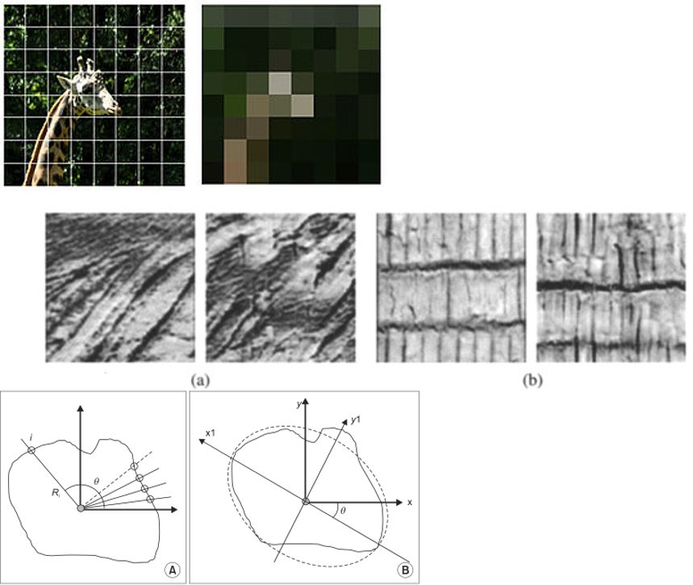

Si bien es cierto que hay montones de descriptores, trabajaremos por ahora con los descriptores de color - puntualmente uno muy sencillo de obtener llamado **histograma de color**: Un histograma es una gráfica de barras que nos dice que colores hay en una imagen, y como puedes imaginar, los colores que más se repiten tienen una barra mas larga. Cuando trabajamos con imágenes en escala de grises, manejamos un histograma con valores de 0 a 255. 

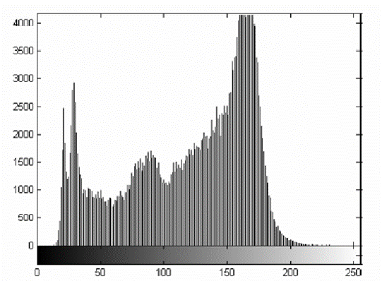

Y en el caso de histogramas a color, es el mismo principio, pero con los canales Rojo, Verde y Azul, los cuales concatenamos juntos, para generar un solo histograma de 256 x 3 = 768 valores. 

- *__Nota importante:__ Evita utilizar un histograma para cada uno de los colores, toma en cuenta que es mas fácil manejar un histograma de 256 x 3 = 768 colores, que manejar un histograma de 256 x 256 x 256 = 16,777,216 colores. Además, muchos de los colores estarán en 0, es muy raro ver una imagen que utilice TODOS los colores a la vez.*

Con lo que hemos visto de histogramas, puedes verlo implementado en el [ejemplo 03.](Ejemplo03/Ejemplo03.ipynb)

También debes de saber que los histogramas no son perfectos descriptores. Suelen ser útiles, pero no son perfectos. Por ejemplo, un histograma no es resistente a la escala: Una imagen mas grande tiene mas pixeles de ciertos colores, por ende, tiene un descriptor que puede ser diferente. De igual manera, si haces zoom in-out a un objeto, su histograma cambiará. Recuerda entonces que los objetos deben tener mas o menos el mismo tamaño para que sirva.

## Reto 03: 
> Con tres imágenes parecidas, en fondo blanco y del mismo tamaño, genera histogramas. Luego repite el proceso con otro objeto distinto, pero las mismas características (fondo blanco, mismo tamaño de imagen). Coteja los histogramas visualmente para ver que realmente los objetos parecidos tienen histogramas parecidos. 

Solución al reto 03 [aquí.](Reto03/Reto03.ipynb)
