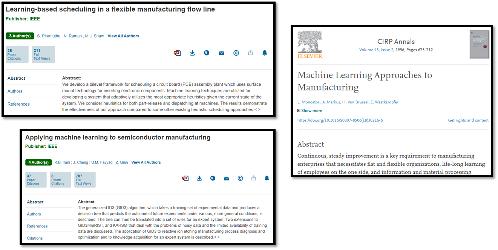
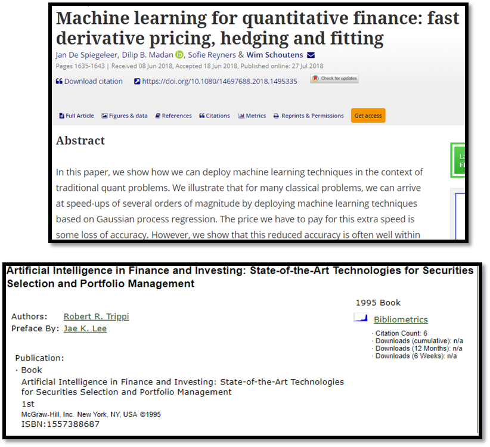

[`Machine Learning`](../../README.md) > [`Sesión 01`](../README.md) > `Ejemplo 4`

## Ejemplo 4: Aplicaciones de Machine Learning

### 1. Objetivos :dart:

- Conocer aplicaciones de ML con el fin de ampliar el panorama sobre qué tipo de problemas pueden ser resueltos con esta herramienta.

### 2. Desarrollo :rocket:

Machine Learning ha tenido un auge enorme por una simple razón: Problemas que antes eran intratables ahora pueden atacarse con estas herramientas. Si todavía no tienes un proyecto en mente que quieras hacer, podemos ver algunas cuantas áreas que se han visto beneficiadas de Machine Learning.

#### Industria Manufacturera:

Los algoritmos de Machine Learning ha sido empleados en construir semiconductores, también para optimizar tareas de trabajo en manufactura.

#### Seguridad y prevención del crimen:

Los algoritmos de Machine Learning también ayudan a hallar la relación entre el crimen y el estado de la sociedad. Es un tema difícil en el que ML comienza a buscar patrones para prevenir el crimen.

#### Finanzas y economía:

Machine Learning brilla cuando tiene que generar tecnología que mapee finanzas o problemas económicos. Dado que la economía es un tema complejo, ML busca patrones entre las variables económicas.

#### Astrofísica y ciencias espaciales.

Dado que las ciencias espaciales están teniendo mas datos cada vez, necesitan cada vez mas de ML para darles sentido y entender los datos.

#### Salud pública y prevención.

Incluso los sistemas y servicios de salud se pueden ver beneficiados por Machine Learning, una de sus aplicaciones puede ser el análisis de políticas de salud y métodos de cuidado de pacientes. 

[`Anterior`](../README.md) | [`Siguiente`](../Reto04/README.md)

